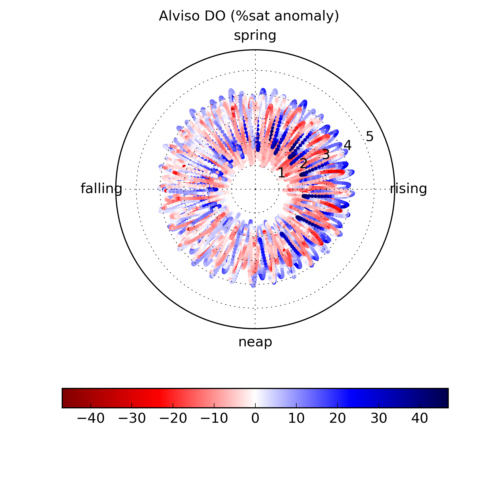

### San Francisco Estuary Institute
I was an Environmental Scientist at the San Francisco Estuary Institute in 2015 -- 16, investigating the effects of nutrient pollution and (potential) eutrophication in San Francisco Bay. I call it "potential" eutrophication because there is a tremendous amount of excess nutrition in SF Bay due to the treated wastewater effluent and agricultural runoff but comparatively infrequent phytoplankton blooms and low autotrophic biomass. I used multiple analytical tools (mostly Python and R) and environmental sensors to quantify the bay’s ever-changing biogeochemistry.

I enjoy visualizing environmental datasets in different ways in order to extract new meaning and to better communicate what we hypothesize is happening in the data. Here’s an example of SFEI’s Lower South San Francisco Bay moored sensor data plotted on polar coordinates (radius ~ pressure; theta ~ tidal springiness; color represents the high pass filtered dissolved oxygen, in % of saturation).

Check out The Mooring Report, a monthly e-newsletter from SFEI (I’m the editor and a frequent contributor) which provides snapshots of San Francisco Bay’s ecosystem nutrition. Take a look at our latest edition [here](https://www.sfei.org/tmr/2016-06) and scroll to the bottom of that page to sign up for future editions!
