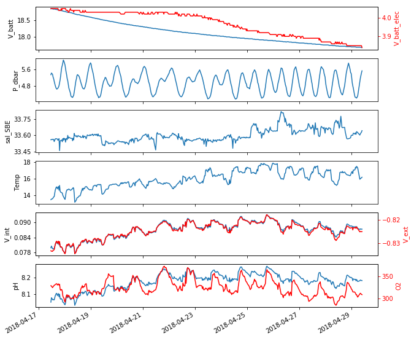
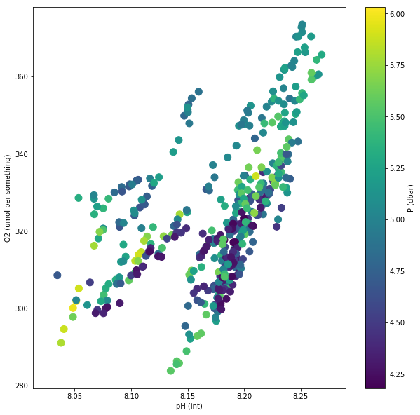

# Google Sheets Scraper
Goal: scrape the Google Sheet with autofilling data from the Particle Electron at Carlsbad Aquafarm
[Google Sheet named "SeapHOx_OuterLagoon" is here](https://docs.google.com/spreadsheets/d/19jxQzqJa_B5zZJJmd6LmJDA0utKn0NTWoeNK_HkOse4/edit#gid=0)


```python
import numpy as np
import pandas as pd
# import seaborn as sns
import matplotlib.pyplot as plt
import matplotlib.ticker as ticker
import os

%matplotlib inline
```

### Scrape Google Sheets
Run python script from https://developers.google.com/sheets/api/quickstart/python which needs to run separately as it interacts with the web browser (in other words, don't copy and paste script into here.


```python
%run ./quickstart.py
type(values)
print(values[-5:])
```

    [['4/29/2018', '0'], ['4/29/2018', '2018/04/29,15:00:25,17.670,0.08714,-0.82506,5.01400,8.18175,310.02399,15.91200,33.60140,3.85,56.95'], ['4/29/2018', '2018/04/29,15:30:25,17.670,0.08737,-0.82489,5.18100,8.18591,311.35199,15.98480,33.61370,3.85,56.95'], ['4/29/2018', '2018/04/29,16:30:25,17.660,0.08725,-0.82500,5.42200,8.18278,308.76801,16.10410,33.62830,3.85,56.63'], ['4/29/2018', '2018/04/29,17:00:25,17.660,0.08727,-0.82493,5.52100,8.18269,308.05801,16.15570,33.64200,3.84,56.63']]


### Grab Useful Data from Sheet


```python
electron_array = pd.DataFrame(values) # includes timestamp
data_col = electron_array.iloc[:, 1]
data_array = pd.DataFrame(data_col.str.split(',', expand = True))
data_array.columns = ['Date', 'Time', 'V_batt', 'V_int', 'V_ext', 'P_dbar', 'pH_int', 'O2_umolkg', 'temp_SBE', 'sal_SBE', 'V_batt_elec', 'charge_status']
data_array.set_index(pd.to_datetime(data_array['Date'] + ' ' + data_array['Time']), inplace = True)
data_array.drop(['Date', 'Time'], axis = 1, inplace = True)
data_array.head()
```


<div>
<style scoped>
    .dataframe tbody tr th:only-of-type {
        vertical-align: middle;
    }

    .dataframe tbody tr th {
        vertical-align: top;
    }

    .dataframe thead th {
        text-align: right;
    }
</style>
<table border="1" class="dataframe">
  <thead>
    <tr style="text-align: right;">
      <th></th>
      <th>V_batt</th>
      <th>V_int</th>
      <th>V_ext</th>
      <th>P_dbar</th>
      <th>pH_int</th>
      <th>O2_umolkg</th>
      <th>temp_SBE</th>
      <th>sal_SBE</th>
      <th>V_batt_elec</th>
      <th>charge_status</th>
    </tr>
  </thead>
  <tbody>
    <tr>
      <th>2018-04-17 18:30:25</th>
      <td>18.860</td>
      <td>0.07985</td>
      <td>-0.83308</td>
      <td>5.33600</td>
      <td>8.05349</td>
      <td>328.51599</td>
      <td>13.43740</td>
      <td>33.55860</td>
      <td>4.05</td>
      <td>84.77</td>
    </tr>
    <tr>
      <th>2018-04-17 19:00:25</th>
      <td>18.870</td>
      <td>0.08055</td>
      <td>-0.83331</td>
      <td>5.41600</td>
      <td>8.08004</td>
      <td>328.32300</td>
      <td>13.48790</td>
      <td>33.56140</td>
      <td>4.05</td>
      <td>84.62</td>
    </tr>
    <tr>
      <th>2018-04-17 19:30:25</th>
      <td>18.860</td>
      <td>0.08002</td>
      <td>-0.83326</td>
      <td>5.38800</td>
      <td>8.07537</td>
      <td>325.82300</td>
      <td>13.53800</td>
      <td>33.55890</td>
      <td>4.05</td>
      <td>84.62</td>
    </tr>
    <tr>
      <th>2018-04-17 20:02:20</th>
      <td>18.860</td>
      <td>0.07946</td>
      <td>-0.83334</td>
      <td>5.35400</td>
      <td>8.06744</td>
      <td>324.28900</td>
      <td>13.54920</td>
      <td>33.56210</td>
      <td>4.05</td>
      <td>84.48</td>
    </tr>
    <tr>
      <th>2018-04-17 20:32:51</th>
      <td>18.850</td>
      <td>0.07959</td>
      <td>-0.83293</td>
      <td>5.21900</td>
      <td>8.06995</td>
      <td>326.27499</td>
      <td>13.65300</td>
      <td>33.56350</td>
      <td>4.05</td>
      <td>84.48</td>
    </tr>
  </tbody>
</table>
</div>


### Filter
- Filter based on date
- Cast to type float (for some reason the str.split leaves it as arbitrary object)
- This was necessary in early notebook as the input data wasn't filtered at all but the Google Sheet should be cleaner to begin with (*i.e.*, no land data)
- Filtration may come in handy later so keep this here for now


```python
date_filt = data_array.index > '2018-04-17 18:30:00'
data_filt = data_array[date_filt]

import pytz
pacific = pytz.timezone('US/Pacific')
data_filt.index = data_filt.index.tz_localize(pytz.utc).tz_convert(pacific)

data_filt = data_filt.astype('float')

data_filt.tail()
# data_filt.V_press
```


<div>
<style scoped>
    .dataframe tbody tr th:only-of-type {
        vertical-align: middle;
    }

    .dataframe tbody tr th {
        vertical-align: top;
    }

    .dataframe thead th {
        text-align: right;
    }
</style>
<table border="1" class="dataframe">
  <thead>
    <tr style="text-align: right;">
      <th></th>
      <th>V_batt</th>
      <th>V_int</th>
      <th>V_ext</th>
      <th>P_dbar</th>
      <th>pH_int</th>
      <th>O2_umolkg</th>
      <th>temp_SBE</th>
      <th>sal_SBE</th>
      <th>V_batt_elec</th>
      <th>charge_status</th>
    </tr>
  </thead>
  <tbody>
    <tr>
      <th>2018-04-29 06:00:25-07:00</th>
      <td>17.67</td>
      <td>0.08756</td>
      <td>-0.82373</td>
      <td>4.323</td>
      <td>8.17703</td>
      <td>302.43900</td>
      <td>17.3059</td>
      <td>33.6242</td>
      <td>3.85</td>
      <td>57.26</td>
    </tr>
    <tr>
      <th>2018-04-29 08:00:25-07:00</th>
      <td>17.67</td>
      <td>0.08714</td>
      <td>-0.82506</td>
      <td>5.014</td>
      <td>8.18175</td>
      <td>310.02399</td>
      <td>15.9120</td>
      <td>33.6014</td>
      <td>3.85</td>
      <td>56.95</td>
    </tr>
    <tr>
      <th>2018-04-29 08:30:25-07:00</th>
      <td>17.67</td>
      <td>0.08737</td>
      <td>-0.82489</td>
      <td>5.181</td>
      <td>8.18591</td>
      <td>311.35199</td>
      <td>15.9848</td>
      <td>33.6137</td>
      <td>3.85</td>
      <td>56.95</td>
    </tr>
    <tr>
      <th>2018-04-29 09:30:25-07:00</th>
      <td>17.66</td>
      <td>0.08725</td>
      <td>-0.82500</td>
      <td>5.422</td>
      <td>8.18278</td>
      <td>308.76801</td>
      <td>16.1041</td>
      <td>33.6283</td>
      <td>3.85</td>
      <td>56.63</td>
    </tr>
    <tr>
      <th>2018-04-29 10:00:25-07:00</th>
      <td>17.66</td>
      <td>0.08727</td>
      <td>-0.82493</td>
      <td>5.521</td>
      <td>8.18269</td>
      <td>308.05801</td>
      <td>16.1557</td>
      <td>33.6420</td>
      <td>3.84</td>
      <td>56.63</td>
    </tr>
  </tbody>
</table>
</div>


### Plot


```python
fig, axs = plt.subplots(6, 1, figsize = (10, 10), sharex = True)
axs[0].plot(data_filt.index, data_filt.V_batt)
axs[0].set_ylabel('V_batt')
ax2 = axs[0].twinx()
ax2.plot(data_filt.index, data_filt.V_batt_elec, 'r')
ax2.set_ylabel('V_batt_elec', color='r')
ax2.tick_params('y', colors='r')

axs[1].plot(data_filt.index, data_filt.P_dbar)
axs[1].set_ylabel('P_dbar')

axs[2].plot(data_filt.index, data_filt.sal_SBE)
axs[2].set_ylabel('sal_SBE')

axs[3].plot(data_filt.index, data_filt.temp_SBE)
axs[3].set_ylabel('Temp')

axs[4].plot(data_filt.index, data_filt.V_int)
axs[4].set_ylabel('V_int')
ax2 = axs[4].twinx()
ax2.plot(data_filt.index, data_filt.V_ext, 'r')
ax2.set_ylabel('V_ext', color='r')
ax2.tick_params('y', colors='r')

axs[5].plot(data_filt.index, data_filt.pH_int)
axs[5].set_ylabel('pH')
ax2 = axs[5].twinx()
ax2.plot(data_filt.index, data_filt.O2_umolkg, 'r')
ax2.set_ylabel('O2', color='r')
ax2.tick_params('y', colors='r')

axs[0].xaxis_date() # make sure it knows that x is a date/time

for axi in axs.flat:
#     axi.xaxis.set_major_locator(plt.MaxNLocator(3))
#     print(axi)
    axi.yaxis.set_major_locator(plt.MaxNLocator(3))
#     axi.yaxis.set_major_formatter(ticker.FormatStrFormatter("%.02f"))

fig.autofmt_xdate() # makes the date labels easier to read.
```





```python
fig, axs = plt.subplots(1, 1, figsize = (10, 10), sharex = True)
pHOx = axs.scatter(x = data_filt.pH_int,
                   y = data_filt.O2_umolkg,
                   c = data_filt.P_dbar,
                   s = 100)
axs.set_xlabel('pH (int)')
axs.set_ylabel('O2 (umol per something)')
plt.colorbar(pHOx, label = 'P (dbar)');
```





```python
cmap = plt.get_cmap('coolwarm')
corr = data_filt.corr()
corr.style.background_gradient(cmap, axis=1)\
    .set_properties(**{'max-width': '80px', 'font-size': '10pt'})\
    .set_caption("SeapHOx Correlations")\
    .set_precision(2)
```


<style  type="text/css" >
    #T_05464786_4bd4_11e8_976b_784f43925a7brow0_col0 {
            background-color:  #b40426;
            max-width:  80px;
            font-size:  10pt;
        }    #T_05464786_4bd4_11e8_976b_784f43925a7brow0_col1 {
            background-color:  #4257c9;
            max-width:  80px;
            font-size:  10pt;
        }    #T_05464786_4bd4_11e8_976b_784f43925a7brow0_col2 {
            background-color:  #4a63d3;
            max-width:  80px;
            font-size:  10pt;
        }    #T_05464786_4bd4_11e8_976b_784f43925a7brow0_col3 {
            background-color:  #dfdbd9;
            max-width:  80px;
            font-size:  10pt;
        }    #T_05464786_4bd4_11e8_976b_784f43925a7brow0_col4 {
            background-color:  #4961d2;
            max-width:  80px;
            font-size:  10pt;
        }    #T_05464786_4bd4_11e8_976b_784f43925a7brow0_col5 {
            background-color:  #d9dce1;
            max-width:  80px;
            font-size:  10pt;
        }    #T_05464786_4bd4_11e8_976b_784f43925a7brow0_col6 {
            background-color:  #3b4cc0;
            max-width:  80px;
            font-size:  10pt;
        }    #T_05464786_4bd4_11e8_976b_784f43925a7brow0_col7 {
            background-color:  #6b8df0;
            max-width:  80px;
            font-size:  10pt;
        }    #T_05464786_4bd4_11e8_976b_784f43925a7brow0_col8 {
            background-color:  #ca3b37;
            max-width:  80px;
            font-size:  10pt;
        }    #T_05464786_4bd4_11e8_976b_784f43925a7brow0_col9 {
            background-color:  #c83836;
            max-width:  80px;
            font-size:  10pt;
        }    #T_05464786_4bd4_11e8_976b_784f43925a7brow1_col0 {
            background-color:  #3b4cc0;
            max-width:  80px;
            font-size:  10pt;
        }    #T_05464786_4bd4_11e8_976b_784f43925a7brow1_col1 {
            background-color:  #b40426;
            max-width:  80px;
            font-size:  10pt;
        }    #T_05464786_4bd4_11e8_976b_784f43925a7brow1_col2 {
            background-color:  #b50927;
            max-width:  80px;
            font-size:  10pt;
        }    #T_05464786_4bd4_11e8_976b_784f43925a7brow1_col3 {
            background-color:  #bed2f6;
            max-width:  80px;
            font-size:  10pt;
        }    #T_05464786_4bd4_11e8_976b_784f43925a7brow1_col4 {
            background-color:  #b40426;
            max-width:  80px;
            font-size:  10pt;
        }    #T_05464786_4bd4_11e8_976b_784f43925a7brow1_col5 {
            background-color:  #f6a586;
            max-width:  80px;
            font-size:  10pt;
        }    #T_05464786_4bd4_11e8_976b_784f43925a7brow1_col6 {
            background-color:  #d85646;
            max-width:  80px;
            font-size:  10pt;
        }    #T_05464786_4bd4_11e8_976b_784f43925a7brow1_col7 {
            background-color:  #ecd3c5;
            max-width:  80px;
            font-size:  10pt;
        }    #T_05464786_4bd4_11e8_976b_784f43925a7brow1_col8 {
            background-color:  #6b8df0;
            max-width:  80px;
            font-size:  10pt;
        }    #T_05464786_4bd4_11e8_976b_784f43925a7brow1_col9 {
            background-color:  #6a8bef;
            max-width:  80px;
            font-size:  10pt;
        }    #T_05464786_4bd4_11e8_976b_784f43925a7brow2_col0 {
            background-color:  #3b4cc0;
            max-width:  80px;
            font-size:  10pt;
        }    #T_05464786_4bd4_11e8_976b_784f43925a7brow2_col1 {
            background-color:  #b50927;
            max-width:  80px;
            font-size:  10pt;
        }    #T_05464786_4bd4_11e8_976b_784f43925a7brow2_col2 {
            background-color:  #b40426;
            max-width:  80px;
            font-size:  10pt;
        }    #T_05464786_4bd4_11e8_976b_784f43925a7brow2_col3 {
            background-color:  #abc8fd;
            max-width:  80px;
            font-size:  10pt;
        }    #T_05464786_4bd4_11e8_976b_784f43925a7brow2_col4 {
            background-color:  #b70d28;
            max-width:  80px;
            font-size:  10pt;
        }    #T_05464786_4bd4_11e8_976b_784f43925a7brow2_col5 {
            background-color:  #f6a283;
            max-width:  80px;
            font-size:  10pt;
        }    #T_05464786_4bd4_11e8_976b_784f43925a7brow2_col6 {
            background-color:  #d75445;
            max-width:  80px;
            font-size:  10pt;
        }    #T_05464786_4bd4_11e8_976b_784f43925a7brow2_col7 {
            background-color:  #e1dad6;
            max-width:  80px;
            font-size:  10pt;
        }    #T_05464786_4bd4_11e8_976b_784f43925a7brow2_col8 {
            background-color:  #6e90f2;
            max-width:  80px;
            font-size:  10pt;
        }    #T_05464786_4bd4_11e8_976b_784f43925a7brow2_col9 {
            background-color:  #6c8ff1;
            max-width:  80px;
            font-size:  10pt;
        }    #T_05464786_4bd4_11e8_976b_784f43925a7brow3_col0 {
            background-color:  #b2ccfb;
            max-width:  80px;
            font-size:  10pt;
        }    #T_05464786_4bd4_11e8_976b_784f43925a7brow3_col1 {
            background-color:  #84a7fc;
            max-width:  80px;
            font-size:  10pt;
        }    #T_05464786_4bd4_11e8_976b_784f43925a7brow3_col2 {
            background-color:  #7396f5;
            max-width:  80px;
            font-size:  10pt;
        }    #T_05464786_4bd4_11e8_976b_784f43925a7brow3_col3 {
            background-color:  #b40426;
            max-width:  80px;
            font-size:  10pt;
        }    #T_05464786_4bd4_11e8_976b_784f43925a7brow3_col4 {
            background-color:  #92b4fe;
            max-width:  80px;
            font-size:  10pt;
        }    #T_05464786_4bd4_11e8_976b_784f43925a7brow3_col5 {
            background-color:  #c1d4f4;
            max-width:  80px;
            font-size:  10pt;
        }    #T_05464786_4bd4_11e8_976b_784f43925a7brow3_col6 {
            background-color:  #3b4cc0;
            max-width:  80px;
            font-size:  10pt;
        }    #T_05464786_4bd4_11e8_976b_784f43925a7brow3_col7 {
            background-color:  #adc9fd;
            max-width:  80px;
            font-size:  10pt;
        }    #T_05464786_4bd4_11e8_976b_784f43925a7brow3_col8 {
            background-color:  #aac7fd;
            max-width:  80px;
            font-size:  10pt;
        }    #T_05464786_4bd4_11e8_976b_784f43925a7brow3_col9 {
            background-color:  #abc8fd;
            max-width:  80px;
            font-size:  10pt;
        }    #T_05464786_4bd4_11e8_976b_784f43925a7brow4_col0 {
            background-color:  #3b4cc0;
            max-width:  80px;
            font-size:  10pt;
        }    #T_05464786_4bd4_11e8_976b_784f43925a7brow4_col1 {
            background-color:  #b40426;
            max-width:  80px;
            font-size:  10pt;
        }    #T_05464786_4bd4_11e8_976b_784f43925a7brow4_col2 {
            background-color:  #b70d28;
            max-width:  80px;
            font-size:  10pt;
        }    #T_05464786_4bd4_11e8_976b_784f43925a7brow4_col3 {
            background-color:  #c4d5f3;
            max-width:  80px;
            font-size:  10pt;
        }    #T_05464786_4bd4_11e8_976b_784f43925a7brow4_col4 {
            background-color:  #b40426;
            max-width:  80px;
            font-size:  10pt;
        }    #T_05464786_4bd4_11e8_976b_784f43925a7brow4_col5 {
            background-color:  #f49a7b;
            max-width:  80px;
            font-size:  10pt;
        }    #T_05464786_4bd4_11e8_976b_784f43925a7brow4_col6 {
            background-color:  #e36b54;
            max-width:  80px;
            font-size:  10pt;
        }    #T_05464786_4bd4_11e8_976b_784f43925a7brow4_col7 {
            background-color:  #e6d7cf;
            max-width:  80px;
            font-size:  10pt;
        }    #T_05464786_4bd4_11e8_976b_784f43925a7brow4_col8 {
            background-color:  #7093f3;
            max-width:  80px;
            font-size:  10pt;
        }    #T_05464786_4bd4_11e8_976b_784f43925a7brow4_col9 {
            background-color:  #6e90f2;
            max-width:  80px;
            font-size:  10pt;
        }    #T_05464786_4bd4_11e8_976b_784f43925a7brow5_col0 {
            background-color:  #9fbfff;
            max-width:  80px;
            font-size:  10pt;
        }    #T_05464786_4bd4_11e8_976b_784f43925a7brow5_col1 {
            background-color:  #f5c2aa;
            max-width:  80px;
            font-size:  10pt;
        }    #T_05464786_4bd4_11e8_976b_784f43925a7brow5_col2 {
            background-color:  #f6bda2;
            max-width:  80px;
            font-size:  10pt;
        }    #T_05464786_4bd4_11e8_976b_784f43925a7brow5_col3 {
            background-color:  #bbd1f8;
            max-width:  80px;
            font-size:  10pt;
        }    #T_05464786_4bd4_11e8_976b_784f43925a7brow5_col4 {
            background-color:  #f7b599;
            max-width:  80px;
            font-size:  10pt;
        }    #T_05464786_4bd4_11e8_976b_784f43925a7brow5_col5 {
            background-color:  #b40426;
            max-width:  80px;
            font-size:  10pt;
        }    #T_05464786_4bd4_11e8_976b_784f43925a7brow5_col6 {
            background-color:  #a5c3fe;
            max-width:  80px;
            font-size:  10pt;
        }    #T_05464786_4bd4_11e8_976b_784f43925a7brow5_col7 {
            background-color:  #3b4cc0;
            max-width:  80px;
            font-size:  10pt;
        }    #T_05464786_4bd4_11e8_976b_784f43925a7brow5_col8 {
            background-color:  #d4dbe6;
            max-width:  80px;
            font-size:  10pt;
        }    #T_05464786_4bd4_11e8_976b_784f43925a7brow5_col9 {
            background-color:  #d2dbe8;
            max-width:  80px;
            font-size:  10pt;
        }    #T_05464786_4bd4_11e8_976b_784f43925a7brow6_col0 {
            background-color:  #3b4cc0;
            max-width:  80px;
            font-size:  10pt;
        }    #T_05464786_4bd4_11e8_976b_784f43925a7brow6_col1 {
            background-color:  #d75445;
            max-width:  80px;
            font-size:  10pt;
        }    #T_05464786_4bd4_11e8_976b_784f43925a7brow6_col2 {
            background-color:  #d55042;
            max-width:  80px;
            font-size:  10pt;
        }    #T_05464786_4bd4_11e8_976b_784f43925a7brow6_col3 {
            background-color:  #88abfd;
            max-width:  80px;
            font-size:  10pt;
        }    #T_05464786_4bd4_11e8_976b_784f43925a7brow6_col4 {
            background-color:  #e16751;
            max-width:  80px;
            font-size:  10pt;
        }    #T_05464786_4bd4_11e8_976b_784f43925a7brow6_col5 {
            background-color:  #dcdddd;
            max-width:  80px;
            font-size:  10pt;
        }    #T_05464786_4bd4_11e8_976b_784f43925a7brow6_col6 {
            background-color:  #b40426;
            max-width:  80px;
            font-size:  10pt;
        }    #T_05464786_4bd4_11e8_976b_784f43925a7brow6_col7 {
            background-color:  #f6bea4;
            max-width:  80px;
            font-size:  10pt;
        }    #T_05464786_4bd4_11e8_976b_784f43925a7brow6_col8 {
            background-color:  #4b64d5;
            max-width:  80px;
            font-size:  10pt;
        }    #T_05464786_4bd4_11e8_976b_784f43925a7brow6_col9 {
            background-color:  #4b64d5;
            max-width:  80px;
            font-size:  10pt;
        }    #T_05464786_4bd4_11e8_976b_784f43925a7brow7_col0 {
            background-color:  #506bda;
            max-width:  80px;
            font-size:  10pt;
        }    #T_05464786_4bd4_11e8_976b_784f43925a7brow7_col1 {
            background-color:  #e6d7cf;
            max-width:  80px;
            font-size:  10pt;
        }    #T_05464786_4bd4_11e8_976b_784f43925a7brow7_col2 {
            background-color:  #dcdddd;
            max-width:  80px;
            font-size:  10pt;
        }    #T_05464786_4bd4_11e8_976b_784f43925a7brow7_col3 {
            background-color:  #cedaeb;
            max-width:  80px;
            font-size:  10pt;
        }    #T_05464786_4bd4_11e8_976b_784f43925a7brow7_col4 {
            background-color:  #e0dbd8;
            max-width:  80px;
            font-size:  10pt;
        }    #T_05464786_4bd4_11e8_976b_784f43925a7brow7_col5 {
            background-color:  #799cf8;
            max-width:  80px;
            font-size:  10pt;
        }    #T_05464786_4bd4_11e8_976b_784f43925a7brow7_col6 {
            background-color:  #f3c7b1;
            max-width:  80px;
            font-size:  10pt;
        }    #T_05464786_4bd4_11e8_976b_784f43925a7brow7_col7 {
            background-color:  #b40426;
            max-width:  80px;
            font-size:  10pt;
        }    #T_05464786_4bd4_11e8_976b_784f43925a7brow7_col8 {
            background-color:  #3b4cc0;
            max-width:  80px;
            font-size:  10pt;
        }    #T_05464786_4bd4_11e8_976b_784f43925a7brow7_col9 {
            background-color:  #3c4ec2;
            max-width:  80px;
            font-size:  10pt;
        }    #T_05464786_4bd4_11e8_976b_784f43925a7brow8_col0 {
            background-color:  #cb3e38;
            max-width:  80px;
            font-size:  10pt;
        }    #T_05464786_4bd4_11e8_976b_784f43925a7brow8_col1 {
            background-color:  #6180e9;
            max-width:  80px;
            font-size:  10pt;
        }    #T_05464786_4bd4_11e8_976b_784f43925a7brow8_col2 {
            background-color:  #6c8ff1;
            max-width:  80px;
            font-size:  10pt;
        }    #T_05464786_4bd4_11e8_976b_784f43925a7brow8_col3 {
            background-color:  #d3dbe7;
            max-width:  80px;
            font-size:  10pt;
        }    #T_05464786_4bd4_11e8_976b_784f43925a7brow8_col4 {
            background-color:  #6e90f2;
            max-width:  80px;
            font-size:  10pt;
        }    #T_05464786_4bd4_11e8_976b_784f43925a7brow8_col5 {
            background-color:  #efcebd;
            max-width:  80px;
            font-size:  10pt;
        }    #T_05464786_4bd4_11e8_976b_784f43925a7brow8_col6 {
            background-color:  #3b4cc0;
            max-width:  80px;
            font-size:  10pt;
        }    #T_05464786_4bd4_11e8_976b_784f43925a7brow8_col7 {
            background-color:  #445acc;
            max-width:  80px;
            font-size:  10pt;
        }    #T_05464786_4bd4_11e8_976b_784f43925a7brow8_col8 {
            background-color:  #b40426;
            max-width:  80px;
            font-size:  10pt;
        }    #T_05464786_4bd4_11e8_976b_784f43925a7brow8_col9 {
            background-color:  #b40426;
            max-width:  80px;
            font-size:  10pt;
        }    #T_05464786_4bd4_11e8_976b_784f43925a7brow9_col0 {
            background-color:  #ca3b37;
            max-width:  80px;
            font-size:  10pt;
        }    #T_05464786_4bd4_11e8_976b_784f43925a7brow9_col1 {
            background-color:  #6180e9;
            max-width:  80px;
            font-size:  10pt;
        }    #T_05464786_4bd4_11e8_976b_784f43925a7brow9_col2 {
            background-color:  #6b8df0;
            max-width:  80px;
            font-size:  10pt;
        }    #T_05464786_4bd4_11e8_976b_784f43925a7brow9_col3 {
            background-color:  #d3dbe7;
            max-width:  80px;
            font-size:  10pt;
        }    #T_05464786_4bd4_11e8_976b_784f43925a7brow9_col4 {
            background-color:  #6c8ff1;
            max-width:  80px;
            font-size:  10pt;
        }    #T_05464786_4bd4_11e8_976b_784f43925a7brow9_col5 {
            background-color:  #efcfbf;
            max-width:  80px;
            font-size:  10pt;
        }    #T_05464786_4bd4_11e8_976b_784f43925a7brow9_col6 {
            background-color:  #3b4cc0;
            max-width:  80px;
            font-size:  10pt;
        }    #T_05464786_4bd4_11e8_976b_784f43925a7brow9_col7 {
            background-color:  #465ecf;
            max-width:  80px;
            font-size:  10pt;
        }    #T_05464786_4bd4_11e8_976b_784f43925a7brow9_col8 {
            background-color:  #b40426;
            max-width:  80px;
            font-size:  10pt;
        }    #T_05464786_4bd4_11e8_976b_784f43925a7brow9_col9 {
            background-color:  #b40426;
            max-width:  80px;
            font-size:  10pt;
        }</style>  
<table id="T_05464786_4bd4_11e8_976b_784f43925a7b" ><caption>SeapHOx Correlations</caption>
<thead>    <tr>
        <th class="blank level0" ></th>
        <th class="col_heading level0 col0" >V_batt</th>
        <th class="col_heading level0 col1" >V_int</th>
        <th class="col_heading level0 col2" >V_ext</th>
        <th class="col_heading level0 col3" >P_dbar</th>
        <th class="col_heading level0 col4" >pH_int</th>
        <th class="col_heading level0 col5" >O2_umolkg</th>
        <th class="col_heading level0 col6" >temp_SBE</th>
        <th class="col_heading level0 col7" >sal_SBE</th>
        <th class="col_heading level0 col8" >V_batt_elec</th>
        <th class="col_heading level0 col9" >charge_status</th>
    </tr></thead>
<tbody>    <tr>
        <th id="T_05464786_4bd4_11e8_976b_784f43925a7blevel0_row0" class="row_heading level0 row0" >V_batt</th>
        <td id="T_05464786_4bd4_11e8_976b_784f43925a7brow0_col0" class="data row0 col0" >1</td>
        <td id="T_05464786_4bd4_11e8_976b_784f43925a7brow0_col1" class="data row0 col1" >-0.78</td>
        <td id="T_05464786_4bd4_11e8_976b_784f43925a7brow0_col2" class="data row0 col2" >-0.73</td>
        <td id="T_05464786_4bd4_11e8_976b_784f43925a7brow0_col3" class="data row0 col3" >0.11</td>
        <td id="T_05464786_4bd4_11e8_976b_784f43925a7brow0_col4" class="data row0 col4" >-0.74</td>
        <td id="T_05464786_4bd4_11e8_976b_784f43925a7brow0_col5" class="data row0 col5" >0.064</td>
        <td id="T_05464786_4bd4_11e8_976b_784f43925a7brow0_col6" class="data row0 col6" >-0.83</td>
        <td id="T_05464786_4bd4_11e8_976b_784f43925a7brow0_col7" class="data row0 col7" >-0.54</td>
        <td id="T_05464786_4bd4_11e8_976b_784f43925a7brow0_col8" class="data row0 col8" >0.89</td>
        <td id="T_05464786_4bd4_11e8_976b_784f43925a7brow0_col9" class="data row0 col9" >0.89</td>
    </tr>    <tr>
        <th id="T_05464786_4bd4_11e8_976b_784f43925a7blevel0_row1" class="row_heading level0 row1" >V_int</th>
        <td id="T_05464786_4bd4_11e8_976b_784f43925a7brow1_col0" class="data row1 col0" >-0.78</td>
        <td id="T_05464786_4bd4_11e8_976b_784f43925a7brow1_col1" class="data row1 col1" >1</td>
        <td id="T_05464786_4bd4_11e8_976b_784f43925a7brow1_col2" class="data row1 col2" >0.99</td>
        <td id="T_05464786_4bd4_11e8_976b_784f43925a7brow1_col3" class="data row1 col3" >-0.081</td>
        <td id="T_05464786_4bd4_11e8_976b_784f43925a7brow1_col4" class="data row1 col4" >0.99</td>
        <td id="T_05464786_4bd4_11e8_976b_784f43925a7brow1_col5" class="data row1 col5" >0.51</td>
        <td id="T_05464786_4bd4_11e8_976b_784f43925a7brow1_col6" class="data row1 col6" >0.81</td>
        <td id="T_05464786_4bd4_11e8_976b_784f43925a7brow1_col7" class="data row1 col7" >0.23</td>
        <td id="T_05464786_4bd4_11e8_976b_784f43925a7brow1_col8" class="data row1 col8" >-0.51</td>
        <td id="T_05464786_4bd4_11e8_976b_784f43925a7brow1_col9" class="data row1 col9" >-0.51</td>
    </tr>    <tr>
        <th id="T_05464786_4bd4_11e8_976b_784f43925a7blevel0_row2" class="row_heading level0 row2" >V_ext</th>
        <td id="T_05464786_4bd4_11e8_976b_784f43925a7brow2_col0" class="data row2 col0" >-0.73</td>
        <td id="T_05464786_4bd4_11e8_976b_784f43925a7brow2_col1" class="data row2 col1" >0.99</td>
        <td id="T_05464786_4bd4_11e8_976b_784f43925a7brow2_col2" class="data row2 col2" >1</td>
        <td id="T_05464786_4bd4_11e8_976b_784f43925a7brow2_col3" class="data row2 col3" >-0.14</td>
        <td id="T_05464786_4bd4_11e8_976b_784f43925a7brow2_col4" class="data row2 col4" >0.98</td>
        <td id="T_05464786_4bd4_11e8_976b_784f43925a7brow2_col5" class="data row2 col5" >0.53</td>
        <td id="T_05464786_4bd4_11e8_976b_784f43925a7brow2_col6" class="data row2 col6" >0.82</td>
        <td id="T_05464786_4bd4_11e8_976b_784f43925a7brow2_col7" class="data row2 col7" >0.17</td>
        <td id="T_05464786_4bd4_11e8_976b_784f43925a7brow2_col8" class="data row2 col8" >-0.45</td>
        <td id="T_05464786_4bd4_11e8_976b_784f43925a7brow2_col9" class="data row2 col9" >-0.46</td>
    </tr>    <tr>
        <th id="T_05464786_4bd4_11e8_976b_784f43925a7blevel0_row3" class="row_heading level0 row3" >P_dbar</th>
        <td id="T_05464786_4bd4_11e8_976b_784f43925a7brow3_col0" class="data row3 col0" >0.11</td>
        <td id="T_05464786_4bd4_11e8_976b_784f43925a7brow3_col1" class="data row3 col1" >-0.081</td>
        <td id="T_05464786_4bd4_11e8_976b_784f43925a7brow3_col2" class="data row3 col2" >-0.14</td>
        <td id="T_05464786_4bd4_11e8_976b_784f43925a7brow3_col3" class="data row3 col3" >1</td>
        <td id="T_05464786_4bd4_11e8_976b_784f43925a7brow3_col4" class="data row3 col4" >-0.025</td>
        <td id="T_05464786_4bd4_11e8_976b_784f43925a7brow3_col5" class="data row3 col5" >0.17</td>
        <td id="T_05464786_4bd4_11e8_976b_784f43925a7brow3_col6" class="data row3 col6" >-0.39</td>
        <td id="T_05464786_4bd4_11e8_976b_784f43925a7brow3_col7" class="data row3 col7" >0.083</td>
        <td id="T_05464786_4bd4_11e8_976b_784f43925a7brow3_col8" class="data row3 col8" >0.073</td>
        <td id="T_05464786_4bd4_11e8_976b_784f43925a7brow3_col9" class="data row3 col9" >0.077</td>
    </tr>    <tr>
        <th id="T_05464786_4bd4_11e8_976b_784f43925a7blevel0_row4" class="row_heading level0 row4" >pH_int</th>
        <td id="T_05464786_4bd4_11e8_976b_784f43925a7brow4_col0" class="data row4 col0" >-0.74</td>
        <td id="T_05464786_4bd4_11e8_976b_784f43925a7brow4_col1" class="data row4 col1" >0.99</td>
        <td id="T_05464786_4bd4_11e8_976b_784f43925a7brow4_col2" class="data row4 col2" >0.98</td>
        <td id="T_05464786_4bd4_11e8_976b_784f43925a7brow4_col3" class="data row4 col3" >-0.025</td>
        <td id="T_05464786_4bd4_11e8_976b_784f43925a7brow4_col4" class="data row4 col4" >1</td>
        <td id="T_05464786_4bd4_11e8_976b_784f43925a7brow4_col5" class="data row4 col5" >0.56</td>
        <td id="T_05464786_4bd4_11e8_976b_784f43925a7brow4_col6" class="data row4 col6" >0.74</td>
        <td id="T_05464786_4bd4_11e8_976b_784f43925a7brow4_col7" class="data row4 col7" >0.19</td>
        <td id="T_05464786_4bd4_11e8_976b_784f43925a7brow4_col8" class="data row4 col8" >-0.45</td>
        <td id="T_05464786_4bd4_11e8_976b_784f43925a7brow4_col9" class="data row4 col9" >-0.45</td>
    </tr>    <tr>
        <th id="T_05464786_4bd4_11e8_976b_784f43925a7blevel0_row5" class="row_heading level0 row5" >O2_umolkg</th>
        <td id="T_05464786_4bd4_11e8_976b_784f43925a7brow5_col0" class="data row5 col0" >0.064</td>
        <td id="T_05464786_4bd4_11e8_976b_784f43925a7brow5_col1" class="data row5 col1" >0.51</td>
        <td id="T_05464786_4bd4_11e8_976b_784f43925a7brow5_col2" class="data row5 col2" >0.53</td>
        <td id="T_05464786_4bd4_11e8_976b_784f43925a7brow5_col3" class="data row5 col3" >0.17</td>
        <td id="T_05464786_4bd4_11e8_976b_784f43925a7brow5_col4" class="data row5 col4" >0.56</td>
        <td id="T_05464786_4bd4_11e8_976b_784f43925a7brow5_col5" class="data row5 col5" >1</td>
        <td id="T_05464786_4bd4_11e8_976b_784f43925a7brow5_col6" class="data row5 col6" >0.085</td>
        <td id="T_05464786_4bd4_11e8_976b_784f43925a7brow5_col7" class="data row5 col7" >-0.34</td>
        <td id="T_05464786_4bd4_11e8_976b_784f43925a7brow5_col8" class="data row5 col8" >0.28</td>
        <td id="T_05464786_4bd4_11e8_976b_784f43925a7brow5_col9" class="data row5 col9" >0.27</td>
    </tr>    <tr>
        <th id="T_05464786_4bd4_11e8_976b_784f43925a7blevel0_row6" class="row_heading level0 row6" >temp_SBE</th>
        <td id="T_05464786_4bd4_11e8_976b_784f43925a7brow6_col0" class="data row6 col0" >-0.83</td>
        <td id="T_05464786_4bd4_11e8_976b_784f43925a7brow6_col1" class="data row6 col1" >0.81</td>
        <td id="T_05464786_4bd4_11e8_976b_784f43925a7brow6_col2" class="data row6 col2" >0.82</td>
        <td id="T_05464786_4bd4_11e8_976b_784f43925a7brow6_col3" class="data row6 col3" >-0.39</td>
        <td id="T_05464786_4bd4_11e8_976b_784f43925a7brow6_col4" class="data row6 col4" >0.74</td>
        <td id="T_05464786_4bd4_11e8_976b_784f43925a7brow6_col5" class="data row6 col5" >0.085</td>
        <td id="T_05464786_4bd4_11e8_976b_784f43925a7brow6_col6" class="data row6 col6" >1</td>
        <td id="T_05464786_4bd4_11e8_976b_784f43925a7brow6_col7" class="data row6 col7" >0.36</td>
        <td id="T_05464786_4bd4_11e8_976b_784f43925a7brow6_col8" class="data row6 col8" >-0.72</td>
        <td id="T_05464786_4bd4_11e8_976b_784f43925a7brow6_col9" class="data row6 col9" >-0.72</td>
    </tr>    <tr>
        <th id="T_05464786_4bd4_11e8_976b_784f43925a7blevel0_row7" class="row_heading level0 row7" >sal_SBE</th>
        <td id="T_05464786_4bd4_11e8_976b_784f43925a7brow7_col0" class="data row7 col0" >-0.54</td>
        <td id="T_05464786_4bd4_11e8_976b_784f43925a7brow7_col1" class="data row7 col1" >0.23</td>
        <td id="T_05464786_4bd4_11e8_976b_784f43925a7brow7_col2" class="data row7 col2" >0.17</td>
        <td id="T_05464786_4bd4_11e8_976b_784f43925a7brow7_col3" class="data row7 col3" >0.083</td>
        <td id="T_05464786_4bd4_11e8_976b_784f43925a7brow7_col4" class="data row7 col4" >0.19</td>
        <td id="T_05464786_4bd4_11e8_976b_784f43925a7brow7_col5" class="data row7 col5" >-0.34</td>
        <td id="T_05464786_4bd4_11e8_976b_784f43925a7brow7_col6" class="data row7 col6" >0.36</td>
        <td id="T_05464786_4bd4_11e8_976b_784f43925a7brow7_col7" class="data row7 col7" >1</td>
        <td id="T_05464786_4bd4_11e8_976b_784f43925a7brow7_col8" class="data row7 col8" >-0.66</td>
        <td id="T_05464786_4bd4_11e8_976b_784f43925a7brow7_col9" class="data row7 col9" >-0.66</td>
    </tr>    <tr>
        <th id="T_05464786_4bd4_11e8_976b_784f43925a7blevel0_row8" class="row_heading level0 row8" >V_batt_elec</th>
        <td id="T_05464786_4bd4_11e8_976b_784f43925a7brow8_col0" class="data row8 col0" >0.89</td>
        <td id="T_05464786_4bd4_11e8_976b_784f43925a7brow8_col1" class="data row8 col1" >-0.51</td>
        <td id="T_05464786_4bd4_11e8_976b_784f43925a7brow8_col2" class="data row8 col2" >-0.45</td>
        <td id="T_05464786_4bd4_11e8_976b_784f43925a7brow8_col3" class="data row8 col3" >0.073</td>
        <td id="T_05464786_4bd4_11e8_976b_784f43925a7brow8_col4" class="data row8 col4" >-0.45</td>
        <td id="T_05464786_4bd4_11e8_976b_784f43925a7brow8_col5" class="data row8 col5" >0.28</td>
        <td id="T_05464786_4bd4_11e8_976b_784f43925a7brow8_col6" class="data row8 col6" >-0.72</td>
        <td id="T_05464786_4bd4_11e8_976b_784f43925a7brow8_col7" class="data row8 col7" >-0.66</td>
        <td id="T_05464786_4bd4_11e8_976b_784f43925a7brow8_col8" class="data row8 col8" >1</td>
        <td id="T_05464786_4bd4_11e8_976b_784f43925a7brow8_col9" class="data row8 col9" >1</td>
    </tr>    <tr>
        <th id="T_05464786_4bd4_11e8_976b_784f43925a7blevel0_row9" class="row_heading level0 row9" >charge_status</th>
        <td id="T_05464786_4bd4_11e8_976b_784f43925a7brow9_col0" class="data row9 col0" >0.89</td>
        <td id="T_05464786_4bd4_11e8_976b_784f43925a7brow9_col1" class="data row9 col1" >-0.51</td>
        <td id="T_05464786_4bd4_11e8_976b_784f43925a7brow9_col2" class="data row9 col2" >-0.46</td>
        <td id="T_05464786_4bd4_11e8_976b_784f43925a7brow9_col3" class="data row9 col3" >0.077</td>
        <td id="T_05464786_4bd4_11e8_976b_784f43925a7brow9_col4" class="data row9 col4" >-0.45</td>
        <td id="T_05464786_4bd4_11e8_976b_784f43925a7brow9_col5" class="data row9 col5" >0.27</td>
        <td id="T_05464786_4bd4_11e8_976b_784f43925a7brow9_col6" class="data row9 col6" >-0.72</td>
        <td id="T_05464786_4bd4_11e8_976b_784f43925a7brow9_col7" class="data row9 col7" >-0.66</td>
        <td id="T_05464786_4bd4_11e8_976b_784f43925a7brow9_col8" class="data row9 col8" >1</td>
        <td id="T_05464786_4bd4_11e8_976b_784f43925a7brow9_col9" class="data row9 col9" >1</td>
    </tr></tbody>
</table>
