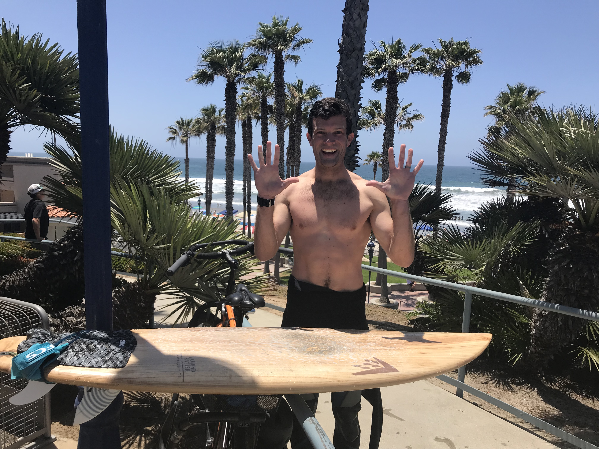
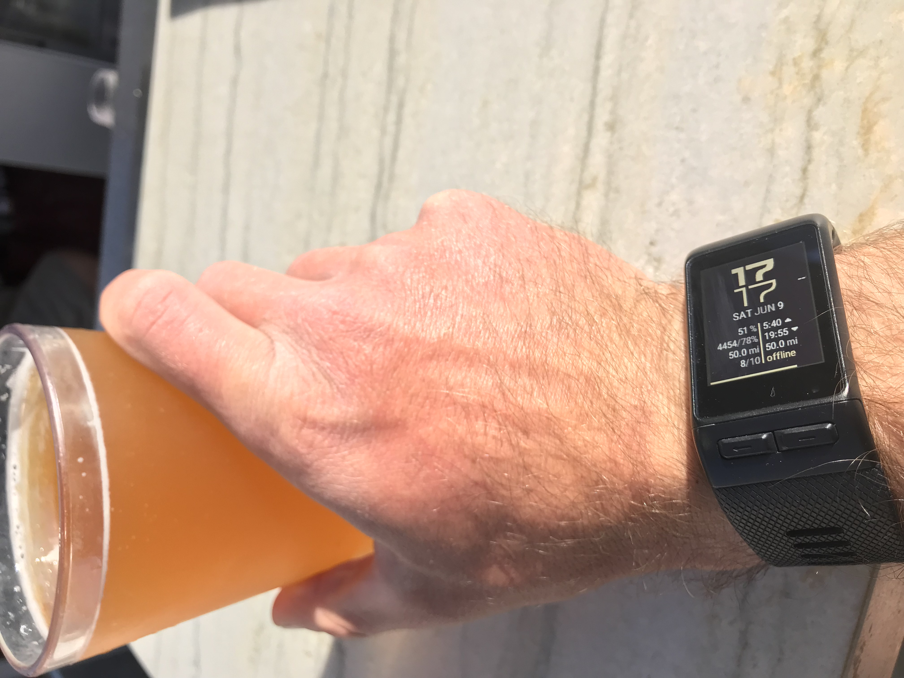
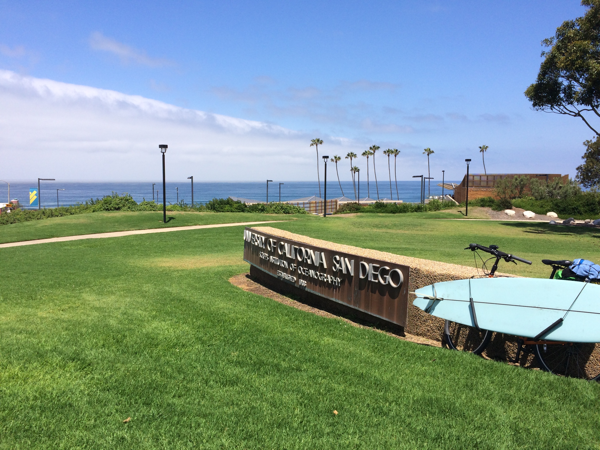
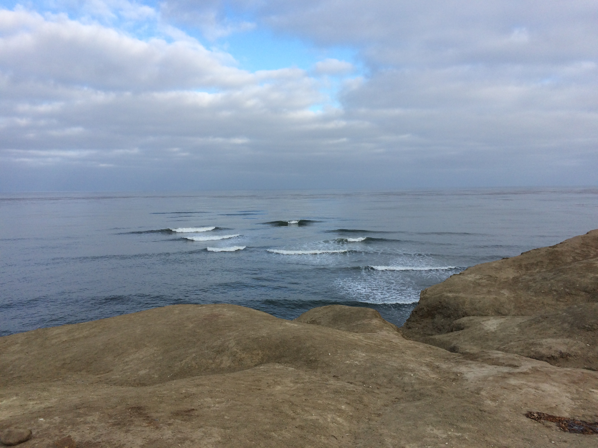
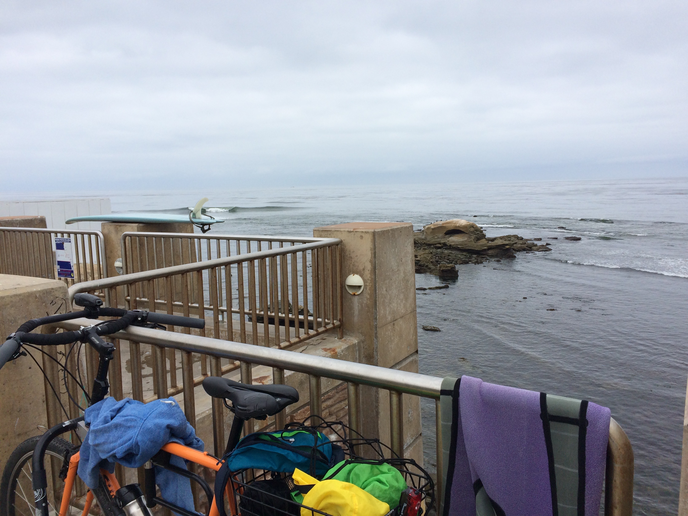
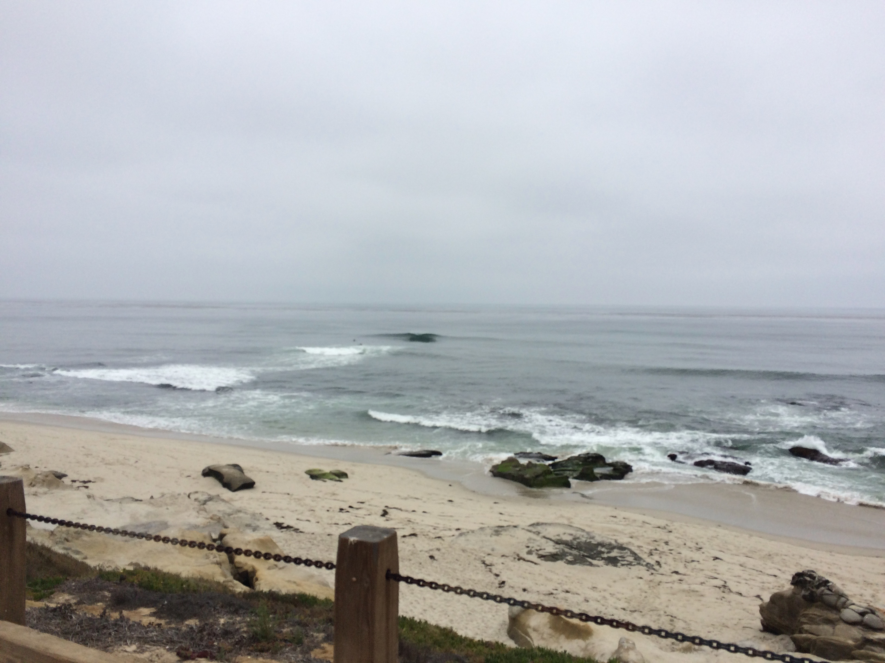
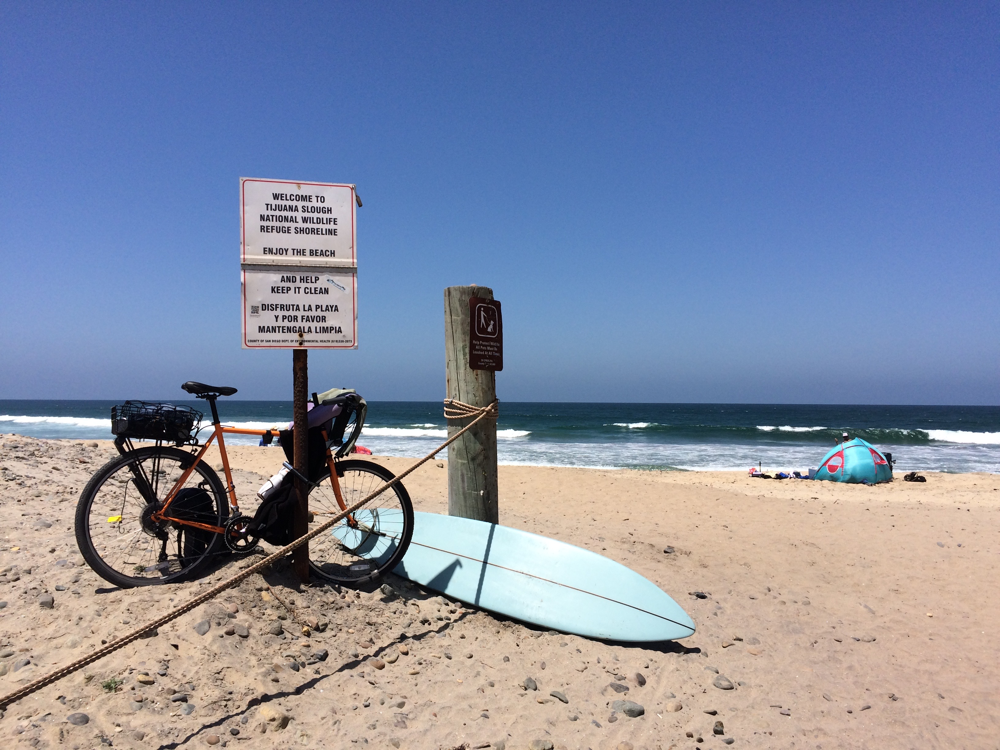
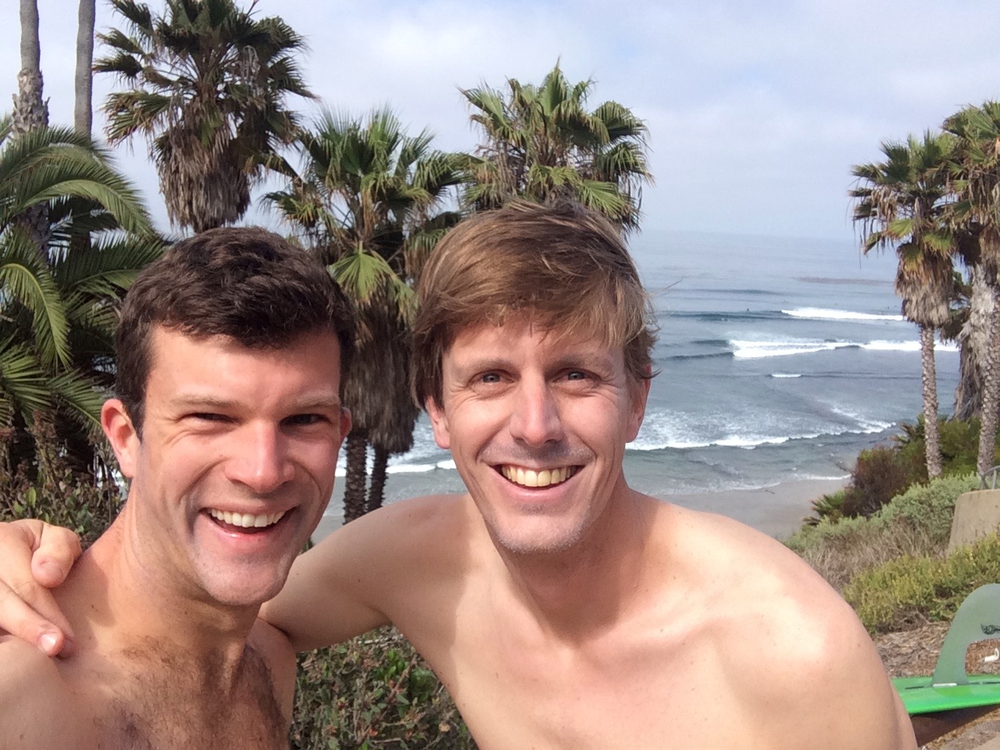
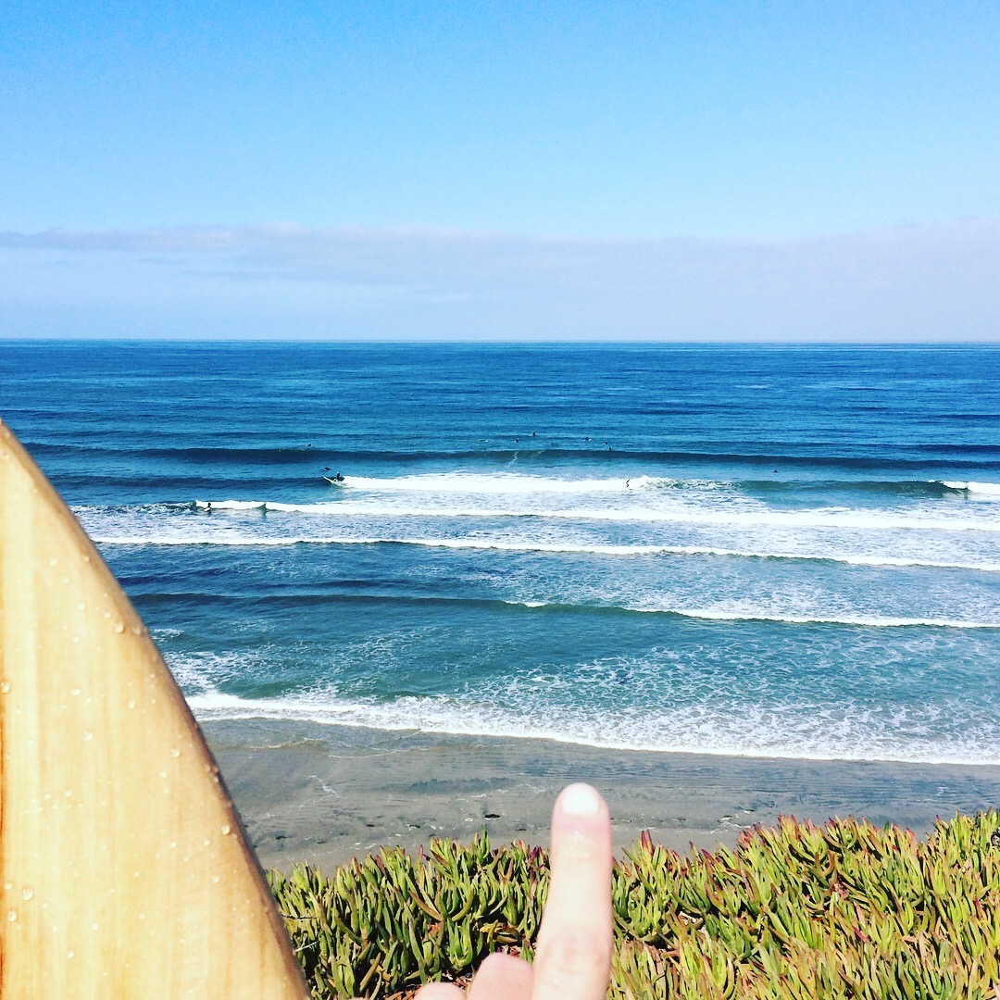

### The Sustainable Pursuit of Micro-Adventures
Exploration seems to imply&mdash;if not require&mdash;some sort of long journey. Usually at least one flight or road trip and probably a different time zone. Neglecting, quitting, or changing your full-time job. It doesn't have to. In fact, perhaps responsible exploration and tourism shouldn't require long journeys at all.

I know I'm not alone when I say that I'd like to go on an adventure but struggle to figure out how, when, and where. I've long dreamed of biking across a continent and paddling a country's coastline. Maybe someday I'll do at least one of those. But, for now, my plan is to chase micro-adventures: little trips with smaller carbon footprints that don't require putting the rest of my life on hold. And I think you should try doing some too!

_(Please scroll down to see my interactive bike/surf map and my ride logs/pics.)_

### The Goal
I'm calling the first adventure *Bike to Surf Month*. My goal is, rather simply, to surf a different break in San Diego County every day in the month of June, getting to each using only my bike. It might not sound like much, but with more than fifty miles of roads and paths separating the northernmost from southernmost SD breaks and a full-time job, it should keep me busy and give me an opportunity to explore one of the world's nicest coastlines in a comparatively unintrusive way. Maybe I'll finally get better at surfing, too!

My plan is to hit thirty different breaks along the fifty mile stretch from the Mexican border to Orange County, focusing on those closer to home (Pacific Beach) on week days and the more distant ones on weekends. I don't have it all scoped out yet but, as a start, the map below shows many of San Diego's iconic breaks. I'm filling them in with my data as I go and posting (using [#biketosurf](https://www.instagram.com/explore/tags/biketosurf/) and [#biketosurfmonth](https://www.instagram.com/explore/tags/biketosurfmonth/)) updates and random musings on social media. I hope you'll join me with bike and board for a few waves!

_(Spots I've hit are shown in blue dots, those I still need to visit are green; my bike and surf tracks are blue lines.)_

    <iframe class="resp-iframe" src="../interactive-pages/msw-sandiego.html"></iframe>

### Science and Science Communication
I am also excited to use my [#biketosurfmonth](https://www.instagram.com/explore/tags/biketosurfmonth/) journey as an opportunity to expand my studies and promote ocean science outreach. I'm making measurements along the way. [My research](../.) revolves around building ocean sensor networks to improve our understanding of natural and human-caused chemical changes. I'm bringing a [Smartfin](../smartfin) to investigate temperature variability. And I'm working on designing a custom CO2 sensor (more on that in a future post) to observe both land and sea dynamics along my routes.

### The Ride Log
_~380 cumulative cycling/surfing miles_

#### Day 10 (June 10, 2018): Oceanside Pier&mdash;double digits!

Only three weeks till rest day ;) Today was really fun but very intimidating. I don't know North County well at all to begin with and had never surfed in Oceanside and it was very big. In my terms. Which means well overhead.  Fortunately it was a long period swell so there was a lot of time to catch my breath in between poundings when paddling out. I caught a few of the bigger waves I've ridden but a strong onshore wind was really chopping up the surface so I went flying off the face more than once. It also, it turns out, takes a while to get there by bike. I think this will be my northernmost session of the month. We'll see...

I also technically completed my first triathlon of the month. The Carlsbad Triathlon was taking place right on the main road I needed to take in order to get north to Oceanside and the cop stopped me when I got to the south end of the course to say I had to go roughly for miles inland to get around it or walk my bike and board for a bit over a mile (for reasons I don't totally understand, biking southward and walking both directions were allowed but biking northward on the course was not&mdash;maybe something to do with pacing the competitors..?). I opted for the latter but didn't want to walk&mdash;I wasn't trying to spend an extra twenty minutes on my way to the waves&mdash;so I jogged the mile or so with all of my gear. So got a nice bike, run, and surf in today.

#### Day 9 (June 9, 2018): Ponto&mdash;adventure is where you find it

(Check out the mileage shown in the bottom right of the watch face; I think I earned that beer!)

My first reaction to my first flat tire on the road was to be annoyed, of course, but it turned into a pretty cool experience. I carry spares of most things that I think I could need out there, including tubes and patches, but I was in the middle of Solana Beach when it happened and I thought it would be nice to use a floor pump, instead of my hand pump, to get a little more pressure into the repaired tube. So I pulled over at Revolution Bike Shop and got to work. While I was getting things back in order, one of the mechanics came over to check out my board (a beautiful, eye-catching, wood veneered FireWire board) and exclaimed, "your fin has a chip in it!" Took me a sec to realize he meant not a bad scratch but rather a computer chip; he was checking out my Smartfin. He was really into it and started showing it off to the other mechanics which was pretty cool to see.

I surfed Ponto which looked immaculate when I showed up. Surf magazine cover immaculate. It stayed that way for maybe eight minutes after I got into the water during which time I barely caught one or two but it and I almost immediately ran out of juice. It went completely flat and I totally bonked (not sure that term's used much in surfing but it is in cycling (and other endurance sports) which is how I got there, so I think it's valid). For the next forty minutes, it was small and choppy. I decided to catch my last wave and it picked back up. I guess whatever storm generated the swell took a forty minute break but it came back in full force. This little excursion is definitely succeeding with regard to getting me out of my comfort zone...

#### Day 8 (June 8, 2018): Scripps Pier&mdash;World Oceans Day!

The choice for where to surf today was the most obvious one yet: where I truly learned how to surf and how to be an oceanographer. I'm incredibly lucky to call this my home break for many, many reasons, not least of which is the people I've met here throughout the years. Scripps has been known for producing and housing high quality scientists for over a century but it's our feeling of community that really makes it a great place to work and surf. I surfed next to one of the most preeminent atomspheric and oceanic scientists in the world as well as my buddy about whom I'll probably be saying the same in not all that long. Waves were great: chest &ndash; head high and really clean. Scripps is a great place to surf regularly but it's far from the best as waves frequently close out fast here. That was not the case today so I had a great time surfing and chatting with my friends and colleagues. Happy World Oceans Day, everyone! Please do something kind for the ocean today :) [(Here are some ideas for how.)](https://www.surfrider.org/coastal-blog/entry/world-oceans-day-is-june-8th-heres-how-you-can-make-a-difference)

#### Day 7 (June 7, 2018): Sunset Cliffs/South Garbage&mdash;epic is a story

People's reactions to the word "epic" are individual, based on personal experience. If you're an extreme athlete or YouTube-enabled-couch-junkie, the word likely conjures images of Shaun White hurtling through the air or Rodrigo Koxa screaming down the face of a Nazarean monster; bibliophiles may think of Odysseus and Frodo Baggins. For me, the word sounds like something hard to reach, especially without quitting (or at least changing) my job. I'm on a both month- and lifelong mission to make _epic_ attainable (not to mention sustainable).

Today's session was pretty mellow (I wouldn't necessarily say epic). But the bike ride along OB/Sunset Cliffs is positively gorgeous and, once again, I had a break almost to myself. Sets were pretty crossed-up but the good ones were really good&mdash;maybe shoulder high or so. The hardest part of today's trip was finding a way down to the water. I locked my bike up in the PLNU coastal lot and had to walk around for a while to find the path but the walk was well worth it! One of my primary motivators for doing this whole adventure was to discover new breaks that either I hadn't heard of or had heard of but didn't know how to get to or was too intimidated to try. I'd surfed Cliffs a handful of times before but never down here&mdash;but I'll definitely be back.

#### Day 6 (June 6, 2018): Bird Rock&mdash;incredibly, it just keeps getting better

It's hard to imagine a better start to any day in any place. I'm beginning to think that smaller waves might be at least as much fun as bigger ones because everyone I meet in the water on small days is simply stoked to be alive and in the water. Today I surfed Bird Rock with precisely one other person, one of the friendliest and easiest-to-talk-to guys I've ever met, named Rick. We shared the micro-A-frames for an hour; he went right and I left. Every time. When we simultaneously declared the session over, he paddled to some previously unknown (to me) rock wall and path to the right while I found my familiar staircase on the left. We talked about our families, our lives in Southern California, our roots on the East Coast (we both miss steamers and proper crabcakes), and how amazing it is to be able to take advantage of this beautiful resource that we have out our back doors, even when the swell is down.

From there, I pedaled straight up Bird Rock Ave to a meeting at Bird Rock Coffee Roasters (I'd call that a well planned morning) where I had an inspiring conversation about getting our science out into the world and making it more accessible to citizens of all trainings, backgrounds, and whereabouts, coastal and otherwise. Ben is a rad dude who seems particularly motivated to make a difference through multimedia promotion of other artists, craftspeople, and scientists who are trying to make a difference in their own ways.

Nice hanging out, Rick and Ben. I can only hope to have more days like today!

#### Day 5 (June 5, 2018): Tabletops&mdash;it's all about the bounce

I didn't make that phrase up&mdash;I don't really remember who did (maybe Susan Casey in _The Wave_)&mdash;but it refers to the maneuver, if you will, that surfers need to apply when surfing Teahupoo where getting thrown off of a wave could result in your pummeling on the reef. Today I surfed 2' Tabletops, which makes my comparison to one of the most iconic and critical waves in the world markedly ridiculous, but I kept hearing that phrase repeated in my head throughout the session. Tabletops gets its name, I surmise, from the slab of sandstone that juts roughly 75 yards into the ocean, keeping water depth constant across its width. Waves, even small waves, pitch up quickly when they arrive from comparatively deep (10 feet or more, depending on tide) water to the reef, resulting in a fast ride into very shallow water with an annoyingly hard bottom. I'm definitely going to have to check this spot out again some day when it's a little bigger to see what it's like when the wave (presumably) breaks much further away from shore but today it was about as intimidating as a 2 footer can be in my limited experience. I was startled every time I paddled back out after a wave and my arm reached only a foot or so into the water and touched the seagrass growing on the reef. The water wasn't particularly clear, for better or for worse, so I couldn't really tell where the shallow spots were until the wave took me close enough to see the boils on the surface. I'm never a very aggressive surfer but I took it extra easy today to avoid making too many direct observations of the benthos, though I did manage to scrape my fin on the reef on one duck dive.

Oh, and one other thing. The wind was awful! Not when I was in the water, but it was blasting out of the south (the direction I had to go to get to work after surfing) for the whole ride back. It actually made the relatively protected 500 foot climb up Torrey Pines the most pleasant part of the ride.

Okay, time to go vote (by bike&mdash;duh!).

#### Day 4 (June 4, 2018): Windansea&mdash;calm, quiet, and clean

Don't tell anyone, but this break is amazing... I don't think I've ever packed so much fun into such a short surf session. I had to patch my rear tire this morning right when I was about to head out the door and I thought I had an early meeting (it was cancelled while I was surfing... if only I knew!). So I tried to sprint (my legs were more than a little beat up from yesterday's long rides) up the coast from home to the break to squeeze a few waves in before heading to work. Conditions were right in my sweet spot: a dead calm surface, a terrible Surfline report (so almost no one else was out), and chest high sets. It was one of those mornings where you can hear the water lapping back and forth across your board because everything else is so still and silent. Sometimes that Surfline forecast just really works in your favor.

#### Day 3 (June 3, 2018): Tijuana Slough&mdash;crossed the 100 mile threshold!

Today was one of the coolest solo adventures I've done. I biked and surfed for about six hours total in nearly complete solitude. I saw only one other surfer the whole day and s/he was about two miles north of where I paddled out. Before today, I felt like I'd explored San Diego County reasonably well but after a few hours, I realized how much I've been missing. The San Diego Bayshore Bikeway (which nearly circles San Diego Bay) changes from completely urban to industrial to military to sprawling nature landscapes. I've done much of today's ride before but never alone with nothing but time to take it all in. And I'd seen the southern edge of the Tijuana River National Estuarine Research Reserve (AKA Border Field State Park) on a volunteer trip with Outdoor Outreach years ago but we went straight to the beach and didn't have a chance to explore the estuary. I don't know as much about the reserve as I'd like but it seems to me to be one of the most unaltered ecosystems on Southern California's coastline. On the other hand, it's infamous for its human-caused influx of pollution of many flavors (trash, sewage, etc.), especially during the rainy season when this surf break is effectively closed off for weeks at a time.

#### Day 2 (June 2, 2018): Boneyards&mdash;twice as much fun

Today was awesome! I cycled about 18 miles up the coast and met up with a wonderful friend who helped pick the spot. It was fairly small (waist high on average) but very clean and we even managed to find a spot with almost no one else. It seems like the last few times I've surfed with Mattias, it's been pretty small, but we always manage to have a blast. Mattias is just one of those people who are incredibly hard to be in anything less than a great mood when you're with them, no matter what the conditions.

#### Day 1 (June 1, 2018): Pipes&mdash;it begins!

This is going to be a challenge.

I knew it would be&mdash;that was kind of the point, or at least part of it&mdash;but, wow, my legs were completely exhausted by the time I got into work today after biking to the break, surfing, and biking to the office. It was _only_ a ~25 mile round trip but it was the first time I went more than a couple miles with my board and other gear on my bike.

But it was also a blast. Cycling and surfing are among my favorite activities so starting a Friday off with both was pretty incredible. It was a little on the crowded side, at least given the small take-off spot, but there seemed to be just the right number of waves in most sets for each of us to catch something.

#### Inspired by...
[Bike to Work Month](https://www.recreation.gov/marketing.do?goto=acm/Explore_And_More/exploreArticles/MayisNationalBikeMonth.htm), [Sustainable Surf](http://sustainablesurf.org/2015/09/bike-to-surf-week/), [My Wave Addiction](http://www.mywaveaddiction.com/bike-to-surf/index.html), many close friends & family members, and the ocean.
