### The Sustainable Pursuit of Micro-Adventures
Exploration seems to imply&mdash;if not require&mdash;some sort of long journey. Usually at least one flight or road trip and probably a different time zone. Neglecting, quitting, or changing your full-time job. It doesn't have to. In fact, perhaps responsible exploration and tourism shouldn't require long journeys at all.

I know I'm not alone when I say that I'd like to go on an adventure but struggle to figure out how, when, and where. I've long dreamed of biking across a continent and paddling a country's coastline. Maybe someday I'll do at least one of those. But, for now, my plan is to chase micro-adventures: little trips with smaller carbon footprints that don't require putting the rest of my life on hold. And I think you should try doing some too!

_(Please scroll down to see my interactive bike/surf map and my ride logs/pics.)_

### The Goal
I'm calling the first adventure *Bike to Surf Month*. My goal is, rather simply, to surf a different break in San Diego County every day in the month of June, getting to each using only my bike. It might not sound like much, but with more than fifty miles of roads and paths separating the northernmost from southernmost SD breaks and a full-time job, it should keep me busy and give me an opportunity to explore one of the world's nicest coastlines in a comparatively unintrusive way. Maybe I'll finally get better at surfing, too!

My plan is to hit thirty different breaks along the fifty mile stretch from the Mexican border to Orange County, focusing on those closer to home (Pacific Beach) on week days and the more distant ones on weekends. I don't have it all scoped out yet but, as a start, the map below shows many of San Diego's iconic breaks. I'm filling them in with my data as I go and posting (using [#biketosurf](https://www.instagram.com/explore/tags/biketosurf/) and [#biketosurfmonth](https://www.instagram.com/explore/tags/biketosurfmonth/)) updates and random musings on social media. I hope you'll join me with bike and board for a few waves!

_(My bike and surf tracks are blue lines and my Smartfin temperature data are the colored dots. You can find the code I used to generate this map [here (analysis)](https://github.com/SUPScientist/Website-Analysis/blob/master/Bike-to-Surf-Month/2018-06-01-MSWSites-in-CA-withBikeSmartfinMap.ipynb) and [here (mapping)](https://github.com/SUPScientist/Website-Analysis/blob/master/Bike-to-Surf-Month/2018-06-28-Plotly-Mapbox-ScatterAndLines.ipynb)_

    <iframe class="resp-iframe" src="../interactive-pages/msw-sandiego-mapbox.html"></iframe>

### Science and Science Communication
I am also excited to use my [#biketosurfmonth](https://www.instagram.com/explore/tags/biketosurfmonth/) journey as an opportunity to expand my studies and promote ocean science outreach. I'm making measurements along the way. [My research](../.) revolves around building ocean sensor networks to improve our understanding of natural and human-caused chemical changes. I'm bringing a [Smartfin](../smartfin) to investigate temperature variability and a Garmin sport watch to log my tracks along the way.

### The Ride Log
_868.9 cumulative cycling/surfing miles_

#### Day 30 (June 30, 2018): Moonlight/D Street&mdash;so I guess that happened...
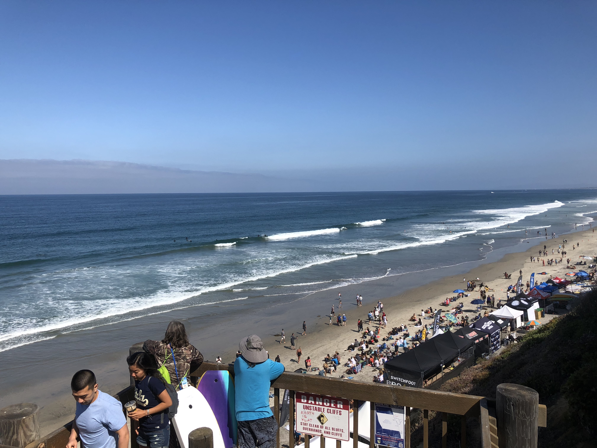

I finished Bike to Surf Month just a couple miles north of where I started but it truly felt completely different. On day 1 at Pipes, I knew very few of North County's iconic breaks, I had absolutely no idea how (or really even if) this month would play out, and I felt slow on my bike. Today I knew exactly where I was going (though I'd never surfed here), I knew that barring any strange last-minute injury to myself, my board or my bike, I was going to make it, and the 20 mile bike felt like a breeze. Heading north, I picked up a group ride with six road cyclists in Del Mar and by the time I broke off at D Street, we'd dropped three of them and passed a handful of others. The whole ride felt quick and easy and conditions looked really fun when I arrived. The Switchfoot Bro-am had just started so there were a ton of people in the water and way more on the beach but I was able to find a spot just south of the contest with a little peak that for some reason no one else wanted. They all wanted to fight over a single peak fifty yards north of me but almost no one came near my spot. I don't think I have any particular knack for finding magical, unoccupied spots, but I do think I have a higher tolerance for "off peak" conditions so when everyone else piles up at the best spot, I'm perfectly content avoiding the crowd and taking whatever comes my way. Maybe this has hampered my development in some ways as I don't make as much of an effort to surf the best waves but I think it's way more fun! And to end this final session, I caught what I think may have been the best right of my life (though my surfing-dedicated neurons don't contain too many images or movies of rights (also, I don't really know how neurons work)).

Of course, my ride home ended in the only way a final ride of a somewhat long adventure (or set of small adventures) could: with a strong headwind. I think the wind would've annoyed me on some other rides this month but, today, I grinned, put my head down, and slogged through it. My chain fell off a few miles before getting home, too, and even somehow cranked my derailleur a bit out of position. Despite thinking that day 28 might've had my final climb up Torrey Pines, I got to do it one more time today and I crushed my PR (well, my Bike to Surf Month PR&mdash;hopefully I can do it at least a little faster on a non-steel road bike without board, wetsuit, and towel).

I went through a decent number of peaks and troughs throughout the month, both physiologically and mentally. I started off feeling strong and excited but after no more than three or four days, it sank in how hard this was going to be. I never made it to the point of seriously considering quitting but I definitely questioned why I declared that I'd do this thing in the first place. I iced my right knee and right shoulder regularly from the end of week 1 through the end of the month and would be lying if I said I didn't pop a few Advils along the way. Week two felt really good (at least that's how I remember it now). There were waves. Lots of waves. And I broke into double digits which was enough of a psychological milestone to convince me that my project was probably achievable. But in week three, the waves largely disappeared and I realized that I was exhausted, my joints hurt, I didn't want to get on my bike, and I couldn't convince myself to feel excited about surfing the poor to mediocre conditions. In any other month, I don't think I would've looked twice at the ocean most days in week three. OB Pier, Cardiff Reef, and Coronado can all be great spots&mdash;just not this week. The final week didn't deliver ideal conditions but I surfed at almost entirely new spots all week so the adventure itself made up for the lack of swell. I don't imagine I'll feel a strong urge to get on both my bike and board for thirty consecutive days again anytime soon but I have to say I'm very happy I tried this.

And before I "sign off," I have to add that I'm very grateful for everything that my wife Shannon did to help enable me to leave early every morning and come home late every night. I definitely did not do my share of our usually evenly divided chores of walking the dog, unloading the dishwasher, or cooking and I have to admit I probably wasn't the most fun companion when I was around, my conversations regularly devolving to either surfing/biking or, more simply, "I'm tired." Thanks, Shannon! I won't do anything like this again for at least a few months ;)

#### Day 29 (June 29, 2018): PB Point/Hermo's&mdash;lucky to get in the water, unlucky for it to be here
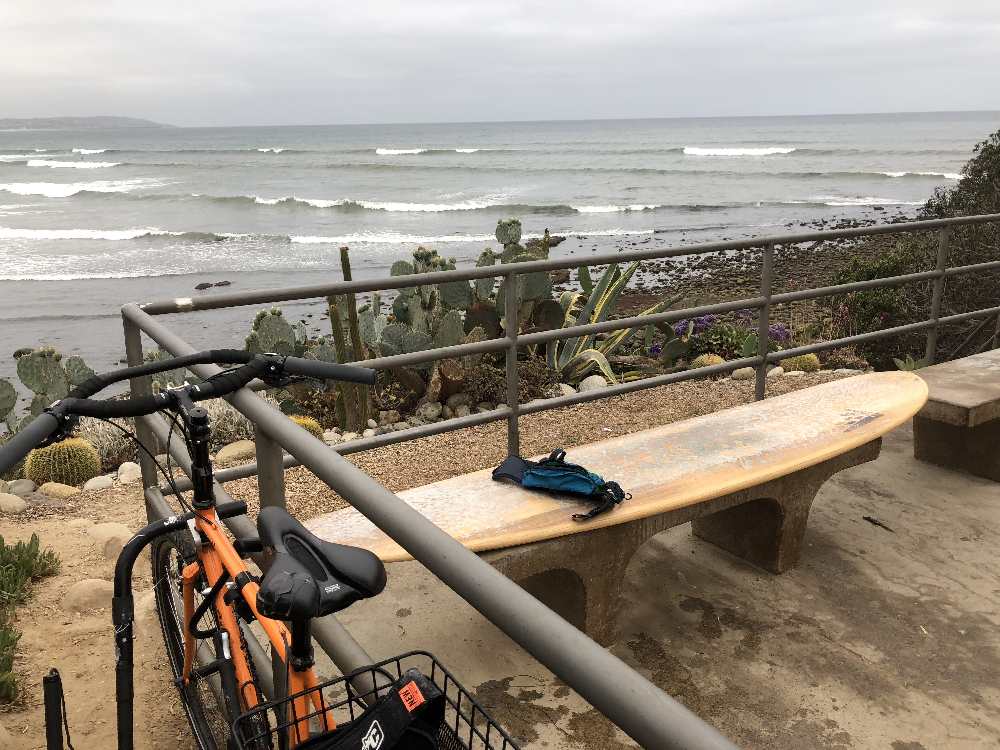

A few of my land-loving (and somewhat surf-zone-fearing) friends have been telling me that their favorite part of watching my journey is discovering that it's actually reasonably unlikely that you'll be eaten by a shark every time you go in the water, even if you're not at a crowded break. Today their voices echoed in my head as I paddled around PB Point to Hermo's through pretty annoying chop in strong winds into the very exposed, waveless, and completely unoccupied reef breaks. There were a handful of times this month where I realized how still, calm, and peaceful the ocean was; today wasn't one of them.

PB Point holds a special place in my heart as the first place where I was justifiably scared out of my mind. As a complete beginner, I'd been intimidated at plenty of beach breaks (and, to be clear, on relatively small days) but my first time out here eight years ago (now perhaps a beginner transitioning to intermediate surfer), I really had no business being here. I'm sure I've surfed much bigger days since and I've probably never truly surfed anything bigger than 8' or so but on this day, it felt like Poseidon had been given orders to take me forever. And if he didn't get me, one of the sixty year old guys on 11' Skip Frye spearguns (not technically guns but boards with way more length and sharpness than necessary) would. I'm usually an overly conservative surfer, especially on bigger days: I sit way too far outside on big days to avoid getting caught by set waves and I rarely go for waves that I see other people paddling for (unless I know they have no chance) so, as a result, I don't catch a whole lot. But I just couldn't seem to get far enough outside on that day and spent most of it in the whitewater, dodging the old dudes who don't exhibit much technique but sure know how to catch a lot of waves and intimidate developing surfers. (To be clear, for any local readers, Skip Frye himself is not among those techniqueless old hotshots but he seems to have found the right board design to sell to them.)

I didn't return to this spot for about six years. It's probably what the old dudes wanted when they took off on every wave with spear-like nose pointed directly at the kooks. And, to be fair, it's not out of the question that I'll be among that crowd some day. But when I returned, I was a much stronger, more competent surfer, and it's now among my favorite spots in the county when it's breaking. Sadly, it needs a bit of size to break at all, and today brought no size. I intentionally saved it for the last week, hoping that what has slowly become a top spot on my list would deliver, and I thought I'd timed the incoming west swell but I just didn't see the strong winds in the forecast and today ended up being a bit of a let down. To make matters worse, it looked awesome at Scripps later that day and I heard it was really fun at Blacks but I didn't have time to get in the water again. Oh well. Lots of vivid memories here already and hopefully many more to come.

#### Day 28 (June 28, 2018): Del Mar Rivermouth/Solana Beach&mdash;disorganized, swell
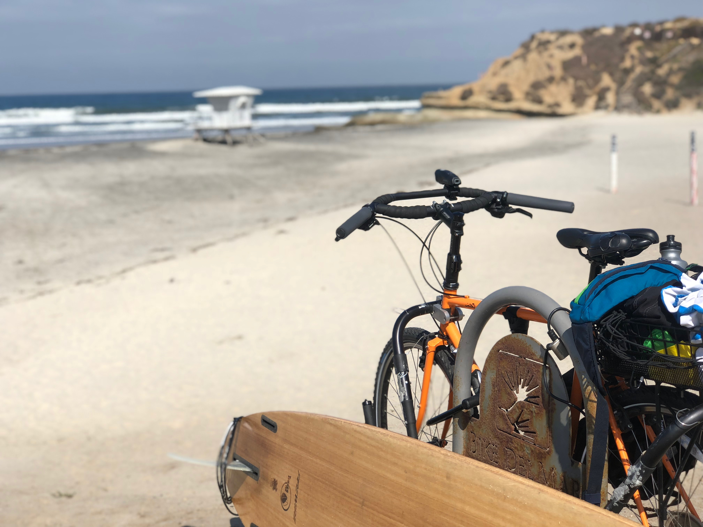

I paddled out right at the rivermouth, directly in front of the Del Mar/San Diego County Fairgrounds. It was a mess. I don't know if it was due to a turning tide with too much water flowing out of the tidal river, mixing sloppily with the incoming waves, or a bunch of haphazardly molded sandbars, but, whatever it was, it wasn't fun. It looked really good from the shore so I was disappointed at first but, looking up the coast, I could see some much cleaner swell coming in. I paddled three-quarters of a mile along the southern Solana Beach cliffs and got out of the slop and into some great waves. They were still breaking somewhat bizarrely but it was a vast improvement over the rivermouth and only two other guys were out at the spot I chose.

I really pushed it back up Torrey Pines on my way into work today, thinking it might be the last fully loaded ride up the hill (turns out it wasn't). It was a beautiful morning with only enough of a breeze to keep things comfortable and I noticed how easy and routine the hill climb was starting to feel. It's not the biggest or steepest climb in the world but it's serious enough that I always got a weird look and/or comment from someone ("a little far from the beach, aren't you?") on the way up.

#### Day 27 (June 27, 2018): Marine Street&mdash;feel the seiche
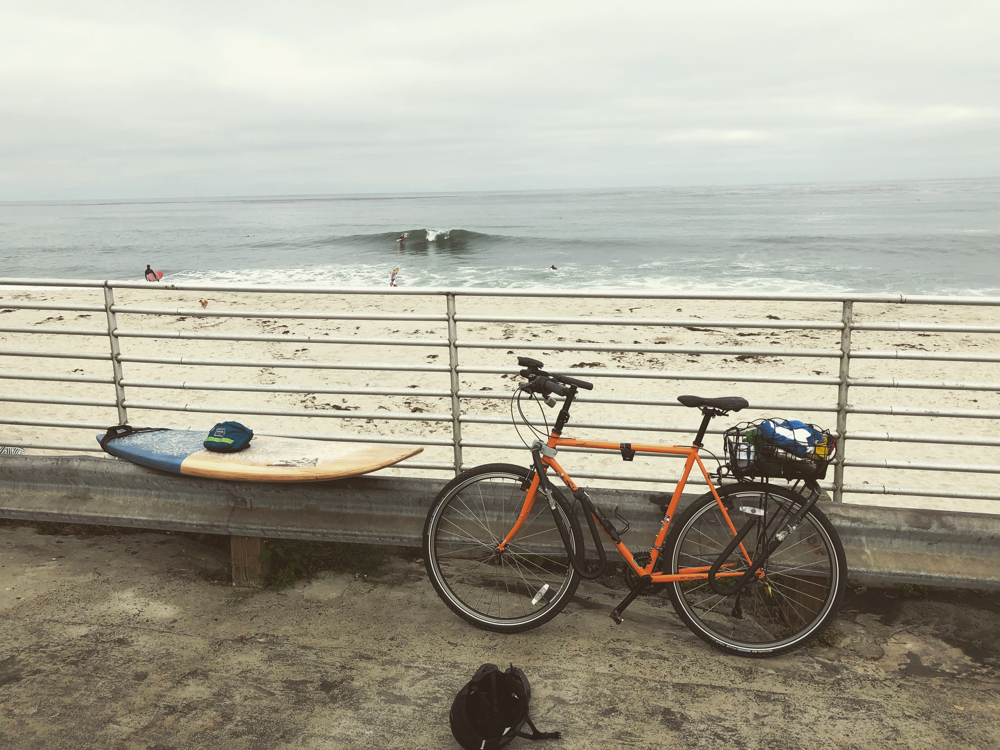

One of the strangest sessions of my life. I've biked past this spot probably a couple hundred times but never surfed it. I'd planned on paddling up to Horseshoe or down to Little Point but the tide was very low and the waves weren't all that big, so everything was breaking right on the rocks. As I was changing into my wetsuit and locking my bike up, I saw three people sitting in the shorebreak only 40 or so yards from Marine St. beach and catching a few nice looking waves, so I thought I'd take a shot there. They got out of the water as I was walking down to the beach, so I paddled out to the break alone. The first fifteen minutes were probably in my top 100 minutes of lifetime surfing; I would catch a nicely peeling left (extra  nice as a goofy foot), look down the face at what seemed to be the beach right below it, make a few easy turns, almost keep enough momentum off of the wave to make it back into the lineup, and repeat. But after fifteen minutes and a bunch of very fun waves, The Conductor just turned everything off. I spent the next forty five minutes or so bouncing up and down and sideways on the interfering waves formed by the backwash coming off of the beach, the small incoming swell, and what felt like must have been a seiche trapped in between the reefs at Horseshoe and Little Point. In a drawn out attempt to catch a last wave in, I completely forgot how to surf, barely made it to my feet, and skittered around the lip, leaving me feeling pretty annoyed with the spot&mdash;or at least my arrival timing. I waited another twenty minutes for the one I told myself would be the final one no matter what but finally gave up and paddled in when I realized this spot only breaks for fifteen minutes when you first arrive and never again. Fortunately, I was able to sneak out into the water later in the day at Scripps with some of my lab and Smartfin crew and picked off a few more good ones so it was a fun day overall!

#### Day 26 (June 26, 2018): Torrey Pines&mdash;"the joy is in the climb itself"
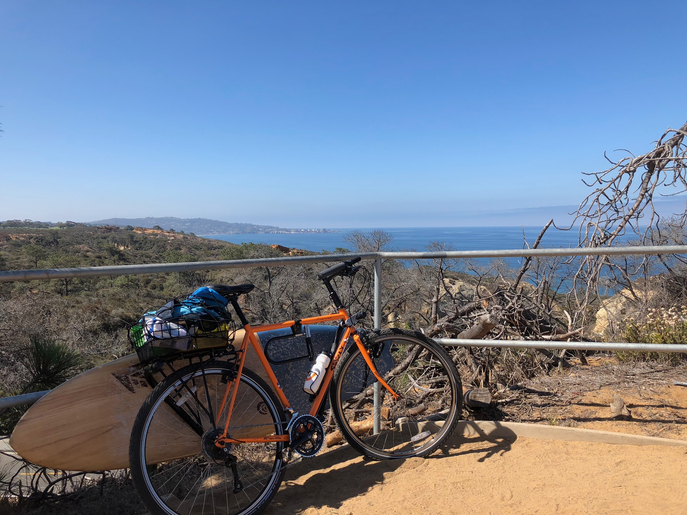

We've all heard this quote (the above version by Mark Manson) said in a ton of different ways: "it's not the destination; it's the journey," "it's the process, not the result," "the doing is more important than the outcome." You get it. Nothing new here. But who actually heeds that advice? I certainly fail to most of the time. I think about hitting the next milestone at work (things will calm down after that, without a doubt...) or going on the next trip (it's so much better there than it is here!). And we all look forward to the end of the day, the weekend, the summer, ...

It was this mindset that me coerce myself into following through with my self-inflicted slog across San Diego County. Or, more accurately, wanting to shake this mindset. The thought process that more or less led to Bike to Surf Month was initially just, "hey, I hear there are a bunch of cool surf breaks in San Diego. I should check them out." But I quickly decided that driving _more_ to "get to" nature was fairly deeply contradictory to my ethos. Or at least what I want to think of as my ethos. I wanted to slow down a little and appreciate the here and the now. And I wanted to do it with minimal fossil fuel use.

This (almost) month of traveling very slowly around my own county has done a lot more for me than simply given me a chance to surf new breaks. And still more than just checking out the beautiful paths between home, work, and those breaks. Those parts have been wonderful and memorable but I think the bigger gain from all of this has been the lesson (which I will certainly have to continue practicing and reteaching myself) that "here" and "now" are pretty special in and of themselves. The joy is in the climb itself. It definitely seems worth reminding ourselves of that from time to time.

#### Day 25 (June 25, 2018): PB Pier&mdash;the final Monday
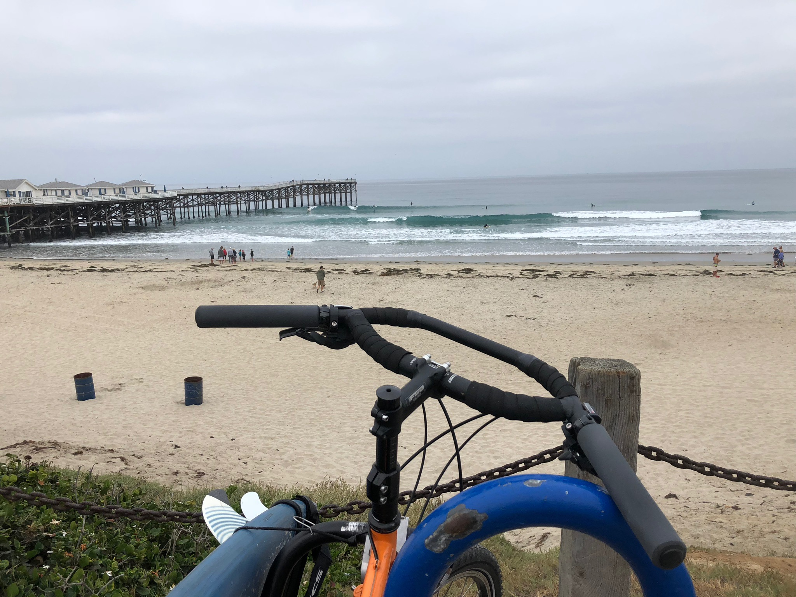

Went for another quick, wetsuitless surf this morning. When I saw the forecast before leaving home, I thought I'd probably be okay with a quick session which going without a wetsuit pretty well enforces. It was pretty fun but definitely small. As the closest break to my home, I think I'll definitely be coming back here with bike and board before long!

#### Day 24 (June 24, 2018): Terra Mar&mdash;land-sea
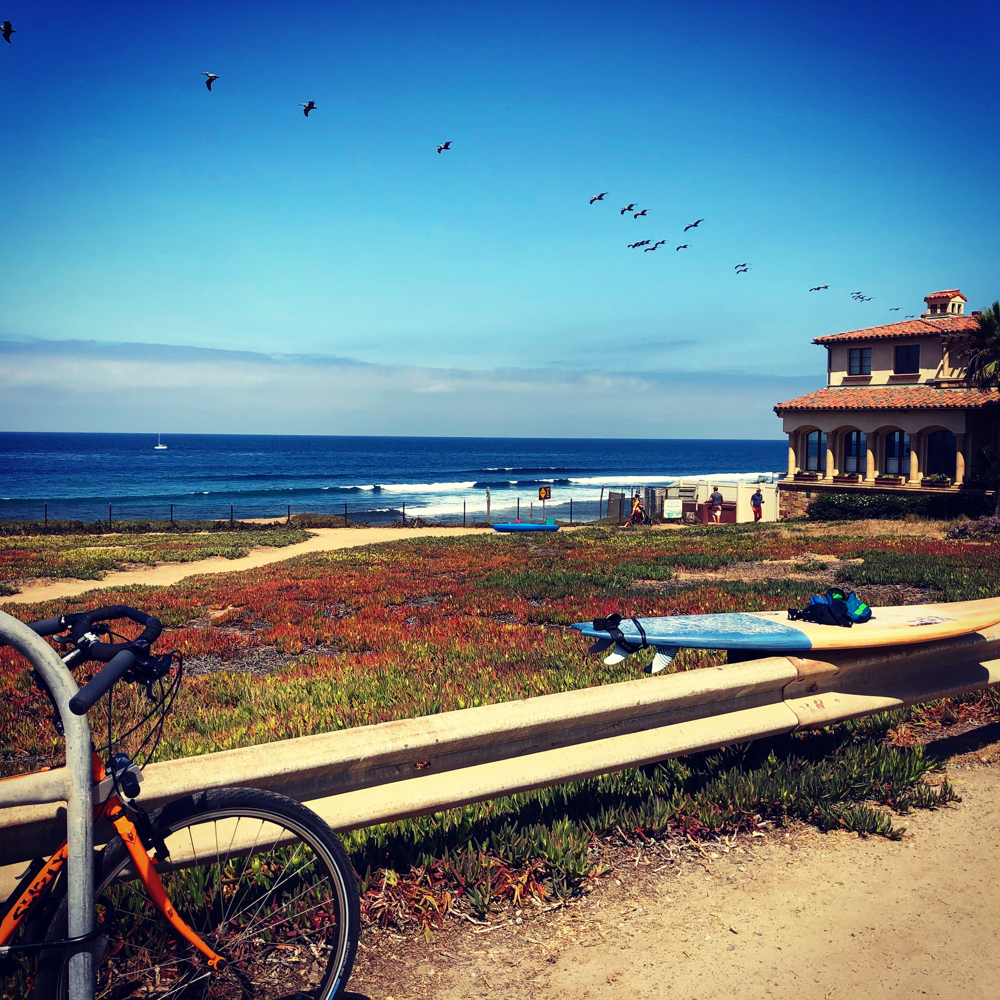

Terra Mar, Span-talian for Land Sea, was almost completely empty and quite fun. I’m not sure where it gets its name, which was likely the proper Spanish “Tierra Mar” at some point, and presumably called something totally different by indigenous folk before that. But maybe it has something to do with the shallow rock reef there, parts of which may be easily visible from the bluffs at low tide giving the appearance of land rising from the sea—conjecture, of course. Had lots of time to ponder this today. My surfing buddies were garibaldi, cormorants, pelicans, and a seal. And certainly countless other critters I couldn’t see.

#### Day 23 (June 23, 2018): Hotel Del Coronado&mdash;3rd day of summer... or winter
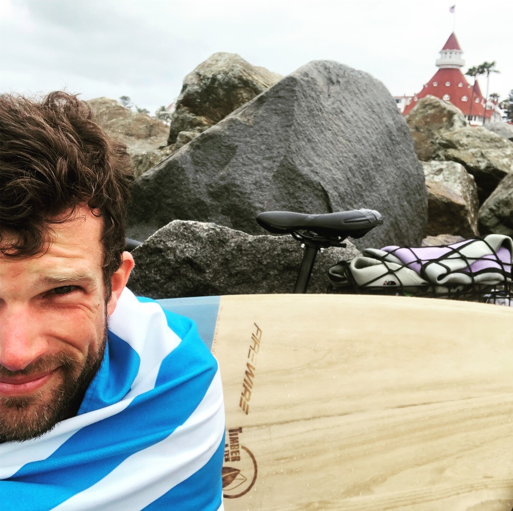

Don’t believe anyone who tries to tell you that Coronado is a nice place in the summer&mdash;they’re lying to you! 15 mph headwinds for the first 20 miles and nothing but wind chop anywhere along the southern San Diego coastline made today a slightly ridiculous day to keep doing this thing. But it was great nonetheless! And I’ve been there on plenty of beautiful, redeeming days too—today was just not one of those days :)

Rode with a three-man group for a few miles talking environmental science and even exchanged info to explore ways to collaborate in the future. It always (and I really do mean always) starts with someone asking about my [Firewire](https://firewiresurfboards.com/) TimberTek/[#ecoboard](https://www.instagram.com/explore/tags/ecoboard/) construction; it catches a lot of eyes.

Took the ferry back across the bay to keep the ride at a meager 42 miles, instead of looping back down around the bay and into the headwind again. Wasn’t the same without you, Kerri, Joao, Paul, Todd, Ellen, and Shannon. Had only Ed Ricketts and John Steinbeck to keep me company and even Ed departed halfway through.

#### Day 22 (June 22, 2018): Cardiff Reef&mdash;frothing for the road
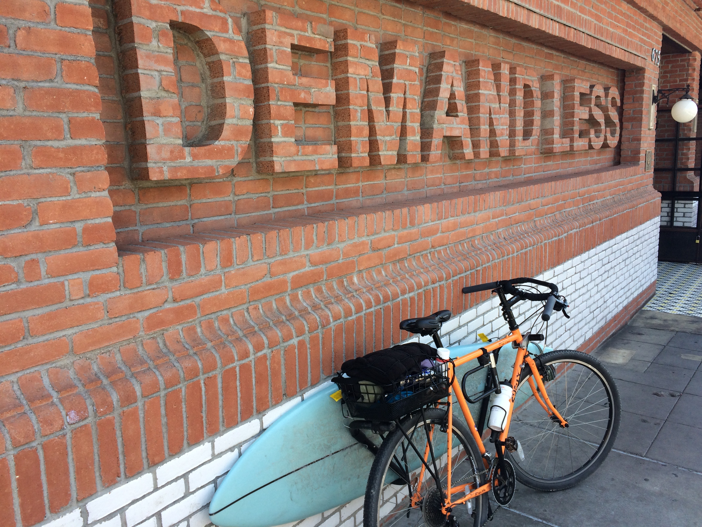

Today’s oceanic frothiness was under the unsharing custody of a few not particularly talented old grumps on 11’ longboards. I’ve come up with a hypothesis that there’s a direct relationship between spikiness of board and human. I prefer fairly softly-nosed boards more and more.

Fortunately the road portion was extra fun, so I suppose things remain in balance. Had one cyclist ask me if I was on an e-bike during a climb (I’m not, so that’s the highest compliment!) and two others suggest that I’d learned to use the board as a sail for my bike to take advantage of the wind to keep up with them. Also had a pretty fun interaction while rolling down a road being used for a wedding shoot.

A few people have asked about my setup, so here are the main details (I’ll probably accidentally neglect something). I’m riding a [Surly](https://surlybikes.com/) Cross-Check with [Schwalbe Tires](https://www.schwalbetires.com/) (extra durable!) and a [Jones](https://jonesbikes.com/h-bars/) H-Bar for great lateral stability and a zillion (well, three) hand positions. I put my (usually [Firewire](https://firewiresurfboards.com/)) board on a [Carver Surf rack](https://carverracks.com/csr-small-block) with a front "small block" extension, again for added stability/reduced wobble. In the rear basket, I carry my wetsuit, a towel, and, since I’m, like, super hip, a fanny pack for valuables that I wear while surfing. Plus lunch and a change of clothes if it’s a work day, a multi-tool, and two locks. I thread the cable lock through my helmet and holes that I paranoiacally put in my shoes, so pretty much everything is locked up or attached to me. And I obviously have my Smartfin (and a [Garmin Vivoactive HR](https://buy.garmin.com/en-US/US/p/538374) sport watch for better GPS tracks). Water bottles, sometimes coffee, and never as much food as I end up wishing I’d brought. So it’s a nice light ride :) You should try it!

#### Day 21 (June 21, 2018): Ocean Beach Pier&mdash;solstice sunset from the water
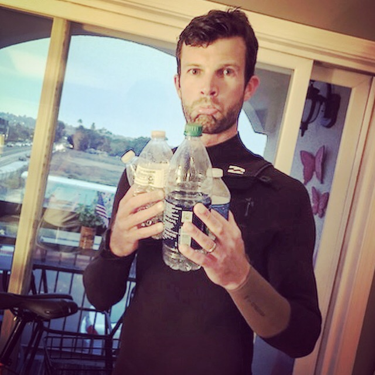

Would've preferred a postcard-worthy shot of the sunset today but between June gloom and following, it appears, the trail of multiple folks who still purchase single use water bottles&mdash;why?? I really don't even understand it anymore!&mdash;today's pic is now sad Phil with your trash. These were just sitting on the beach. Like, as in people just didn't even pretend to care. Sigh...

#### Day 20 (June 20, 2018): Mission Beach&mdash;computational doping
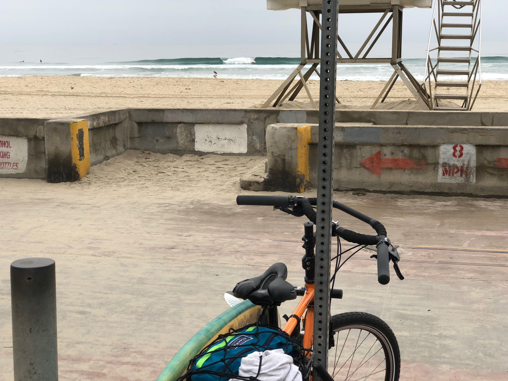

Happy summer, friends! Find the surfer in that picture above (hint: (s)he’s going left). Waves were definitely on the smaller side but it was the glassiest session in weeks. And the water was surprisingly, in fact eerily, clear. I saw way more stingrays than I would've liked so I guess it's officially summer (solstice is tomorrow, but stingrays are the better indicator).

It’s been a fun week of reconnecting with old friends and meeting new ones. Surfed overhead Blacks, choppy but fun Del Mar, small and glassy Mission Beach, and Ocean Beach at sunset. Talked water chemistry with middle schoolers in National City and biked through Pacific Beach with littered water bottles and a plastic shipping cover from (I think) a mattress. Almost time to start the final countdown with 9 days left in the month!

I called this post "computational doping" because I discovered an interesting error in my total distance calculations (the fixing of which greatly diminished my computed miles covered). It's pretty interesting, though, from a GPS functionality and numerical standpoint. I was using a 3-D distance calculator&mdash;basically just calculating the distance between two points in the three dimensional space of our planet (e.g. distance between [lat_1, lon_1, alt_1] --> [lat_2, lon_2, alt_2]) and iterating over all consecutive points and adding it up to get a given ride's distance. There's nothing wrong with this approach, as far as I can tell, on the surface. But it turns out that my GPS watch's barometer "thought" that I was gaining and losing much more elevation than I truly was because it is of course calibrated to atmospheric pressures and I take it into the water. So when I duck dive or get crushed by a big wave and end up a few feet (of water...) below the surface, my watch thinks that I've lost (and subsequently regained) a few thousand feet of elevation. And that's going into the total distance calculation. Oops... Well, now I know more about how my GPS watch works and will pay closer attention to this calculation! I'm now using 2-D distance to circumvent this problem, but, again, I'm moving in three dimensional space so my distance calculated is an underestimate by a slight margin.

#### Day 19 (June 19, 2018): Del Mar Cliffs&mdash;reconnecting
No pics today, sorry! This morning was unique and memorable. I received a gracious invitation via Facebook from an old friend whom I hadn't seen in ~ five years to stop by to surf in essentially her front yard and have coffee and breakfast with her family. It was windy, but the sets were decent, though today's experience was undoubtedly marked by this great reconnection. Thanks again, Bethany, Mark, and Tatum! So wonderful to catch up!

#### Day 18 (June 18, 2018): Blacks&mdash;poor board choice is an understatement
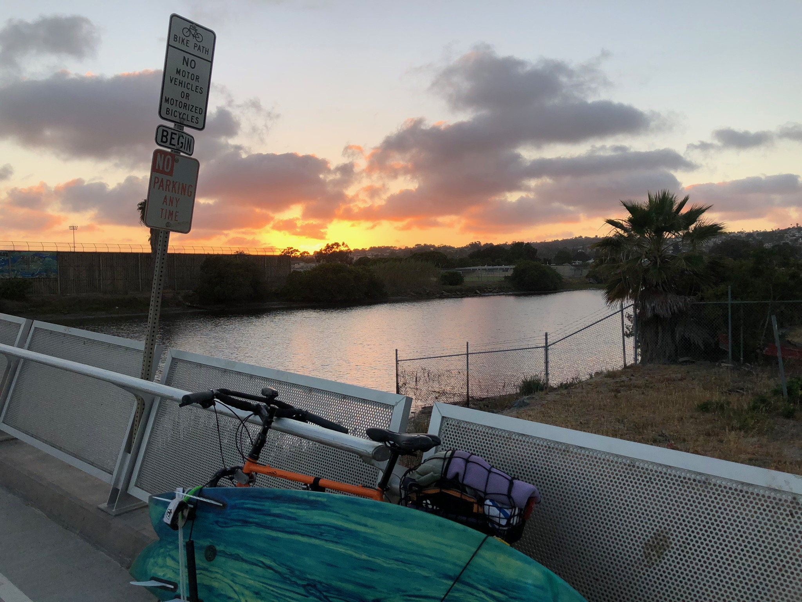

_NB: the board in that pic would've been the right board. I didn't use that this morning. I'm bringing it home tonight so I have it tomorrow. Hopefully that's right._

It was one of those days where just about everything lined up&mdash;except for my board selection. After my ride in, I met up with [NPR's Nathan Rott](https://www.npr.org/people/348779465/nathan-rott) who was in town to interview the [Keeling Group](http://scrippsco2.ucsd.edu/) about atmostpheric CO2 chemistry. A rad, seemingly similarly-minded guy (at least in love for the outdoors), Nate took advantage of his day in San Diego and afternoon meetings to meet up for an early morning session and to surf with and chat about Smartfin. We met at Scripps Pier which looked dead flat and choppy so we opted to walk up the beach to Blacks which was clearly going off. I have one shortboard and one longboard Smartfin and Nate had a shorter board so I gave him that fin, leaving me with the longboard fin and a poorly conceived plan to bring a longboard to overhead Blacks. I more than survived&mdash;I managed to catch some really fun waves&mdash;but I paid the price for bringing that unwieldy tool to a big, occasionally very closed out beach break. Some day I might do that on purpose but today I was really yearning for a 6' or shorter board, both to make more drops and to bail more quickly! It was really fun learning about Nate's job and how he finds stories across the country and he even spent an hour in my office and lab afterwards to ask deeper questions about the Smartfin Project than we could reasonably discuss in the water. Wish I had digital pics of this morning's waves; I still have plenty of mental ones but those are mostly just of walls closing in on me with my nose pointed down the line and all laws of physics suggesting there's no way I'll make it.

#### Day 17 (June 17, 2018): Beacon's&mdash;just keep scoring
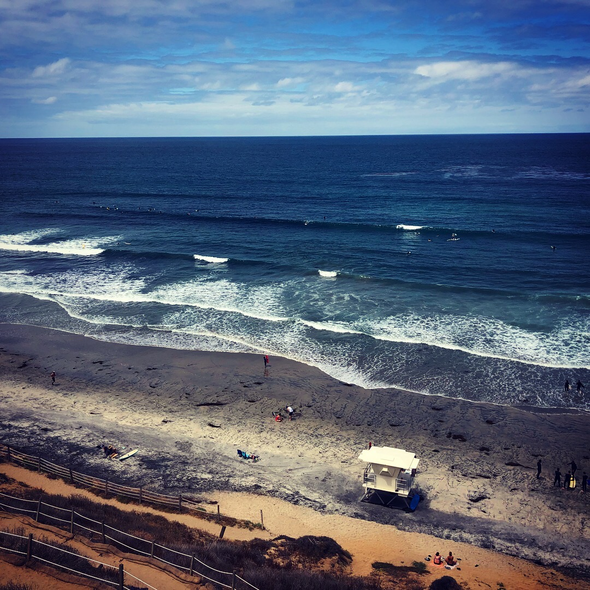

Scored again. Mostly with the people I met but also the swell. I don't know who Beacon is, but I definitely like his or her beach. It was pretty windy on the ride and I didn’t see much in the way of waves as I pedaled 21 miles up the coast but Beacon’s, which can pick up the SW energy and has plenty of offshore kelp to dampen the surface chop, was working nicely today. While paddling for a wave, a heard two folks talking about an upcoming bikepacking trip through Mexico. I got really excited to hear someone talking about bikes so I awkwardly jumped into the conversation and ended up chatting with them for the next 45 minutes. Hoping to make it to their nonprofit’s fundraiser—supporting taking less privileged kids on backpacking trips—later this week too.

Everyone was stoked to find good waves on a day with a mediocre forecast and it wasn’t too crowded; I love days like today where you can feel everyone’s positive vibes.

#### Day 16 (June 16, 2018): La Jolla Shores&mdash;International Surfing Day!
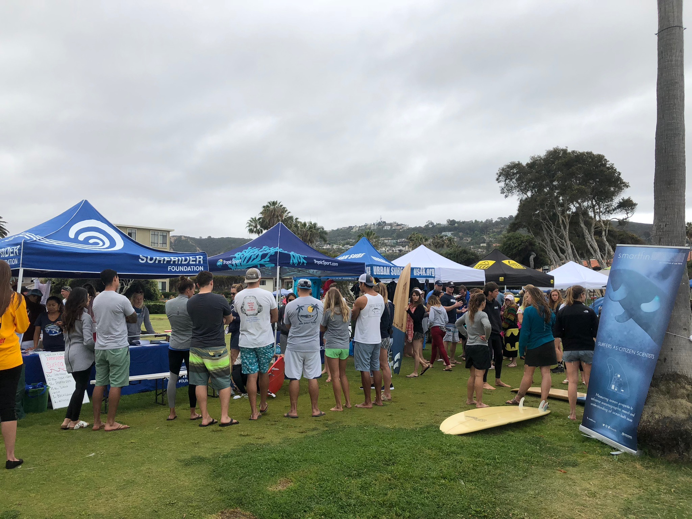

Well the waves left a little something to be desired on this International Surfing Day but the festivities and camaraderie did not. Surfrider Foundation put together a great day of yoga, surfing (with Smartfins!), and a beach cleanup and [Everyday California](https://www.everydaycalifornia.com/) came through huge with the [Galaxy Tacos](https://www.galaxytaco.com/) and [Resident Brewing](http://www.residentbrewing.com/)-featured after party (thanks again, EC!). Traffic heading up Torrey Pines into La Jolla looked annoying so I opted for my first loaded southbound climb up Soledad. It was a slog but well worth it! A cooling drizzle started to fall right as I neared the peak. June Gloom kept things nice and cool for the coast back downhill to the end of a very enjoyable day 16.

#### Day 15 (June 15, 2018): North Bird/Sun Gold Point&mdash;no waves, no problem

I needed a bit of a rest day today so, instead of biking far out of my way, I just stopped at a spot that I've seen break really nicely on a small number of very good days that's on my way to work. Today wasn't a very good day, at least not as far as the swell was concerned. It was tiny, the tide was low, and this spot breaks on a rock reef that you can easily see on Google Maps [(here's a zoomed in view of the reef)](https://www.google.com/maps/@32.8177299,-117.2770667,444m/data=!3m1!1e3) so it looked a little hairy. I considered other options but ended up choosing to jump in and paddle around the cove in my boardshorts and maybe catch one or two if things aligned when I reached the point (they did).

The relative seclusion of this spot in an otherwise very crowded part of La Jolla is pretty spectacular. There's a ~ 6 car parking lot at the top of a few stairs that go down to the beach shown in that picture above but I don't think I've ever seen 6 cars there in the many times I've biked past. Today there was one but its human was nowhere to be found, leaving just me on the beach. I didn't even bother locking my bike up since I knew I'd stay close and, again, there was no one else around. The water was incredibly warm&mdash;69.9 oF according to my Smartfin&mdash;and there was a ton of wildlife in the cove: cormorants, pelicans, seagulls, crabs, and _lots_ of seagrass. I spent a while just checking out the tidepools and watching the crabs scurry along. Not sure I'll go out of my way to come back here for waves any time soon but if I need a quiet rest spot on my way to/from work, now I know where to go.

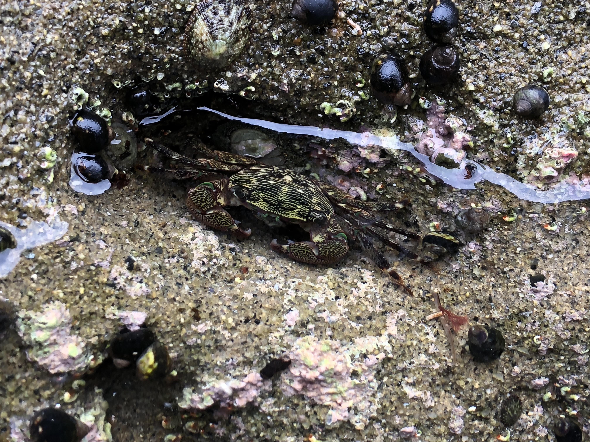

#### Day 14 (June 14, 2018): Cliffs/North Garbage&mdash;how do you choose one favorite spot?!

Found some modest, clean, and once again uncrowded lines at Cliffs/North Garbage this morning and met some rad people in the water (including a guy whom I’d never met but just finished sanding my custom longboard—it’s almost ready(!) and another who offered some great local shallow water navigation tips, exhibiting the exact opposite of the coldness I expect from _locals_ everywhere). Cracked 500 total miles in June too (cycling + surfing though certainly more of the former) which feels like a fun but somewhat surprising milestone. Once again, the summer swell was less than pumping but it was an absolute blast. We got our share of waist to chest high waves with the occasional head high set. I keep thinking I've picked a favorite spot but then I find another spot that's even more fun! This one, being the one I've surfed most recently, is now my favorite.

There’s also something I really like about the log map (above) right now: it looks like I’m making solid progress but at the same time I see a ton of remaining potential. Been listening to Steinbeck’s & Ricketts’ _Log from the Sea of Cortez_ on some rides (one earbud only so I can hear traffic!) and it strikes me as oddly societally and scientifically relevant for a book written 80 years ago but I love (and highly recommend) it. It reminds me of just about every aspect of science (oceanography in particular, of course) and many things I've thought about regarding politics, society, and life in general. Not every joint writer/scientist combo would produce good results but this one certainly did.

#### Day 13 (June 13, 2018): Seaside Reef&mdash;just one of those days
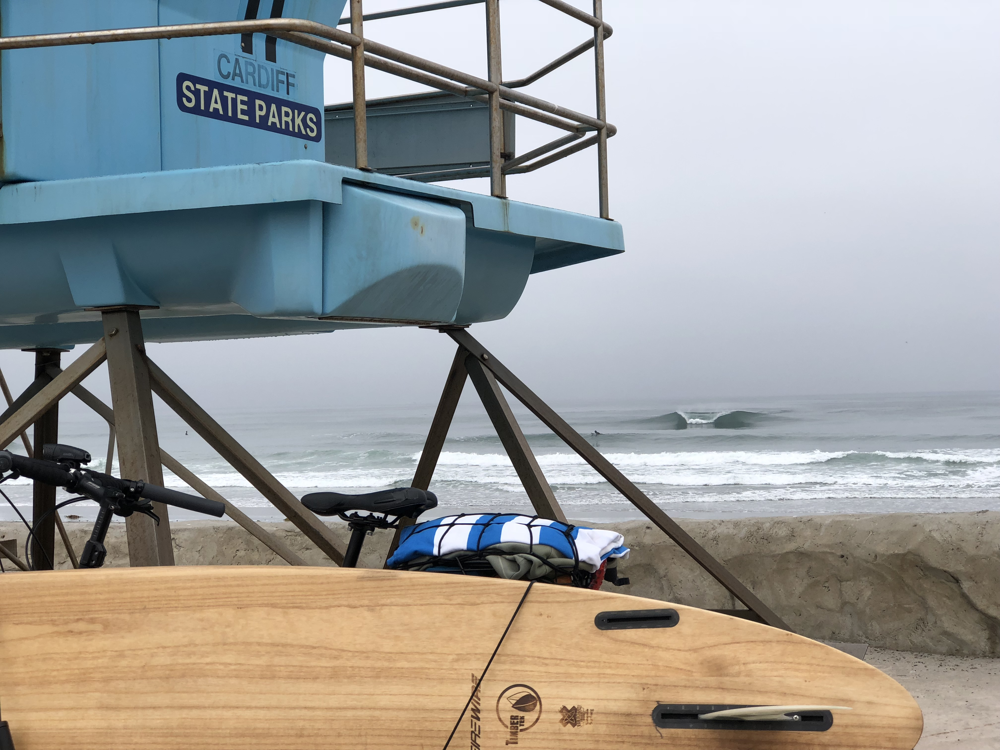

You know those days when your alarm goes off and you just don't feel like doing anything other than going back to bed? Today was the opposite. I'd planned on a relatively short ride&mdash;something in between home and work, most likely. But I just felt really awake and alive when the alarm went off and I thought it seemed like a good morning for a longer ride. I headed up to Cardiff again and found a wave I'd never surfed before. There are lots of those. This was a good one. The Surfline report called for "Fair" conditions. I'm never surprised when they're wrong but it was quite pleasant to see the waves in North County (first at Torrey Pines, where my route first intersects with the coastline, and then in Del Mar, Solana Beach, and finally Cardiff). It was very clean, even (mini)-barreling a bit. I brought a longboard, not knowing what I was going to find but expecting something small and was happy to discover a peak that the shortboarders didn't want to bother with. I guess it was too far outside and breaking a little too crumbly at first, but it had some perfect inside sections.

Another cool thing about today's session was that the parking lot&mdash;part of a state park&mdash;is fairly removed from the neighborhoods of Solana Beach and Cardiff so everyone turned to check out the weirdo on the bike with the board and a whole bunch of other gear in a way that doesn't usually happen in the more populated neighborhoods where lots (well, a few more, at least...) of people bike to surf. I had a fun conversation with two guys who were really curious about the project and my research at Scripps, a unique exchange that probably wouldn't have happened if I showed up in a car. I knew I'd get weird looks and assumed some people would curse at me under or over their breath for invading their spots (if they have, I haven't heard it) but I didn't anticipate the level of curiosity I've (pleasantly!) encountered. This has so far been eye opening for me in some ways I hadn't expected and there's a lot more to go.

#### Day 12 (June 12, 2018): Tourmaline&mdash;is it July yet?
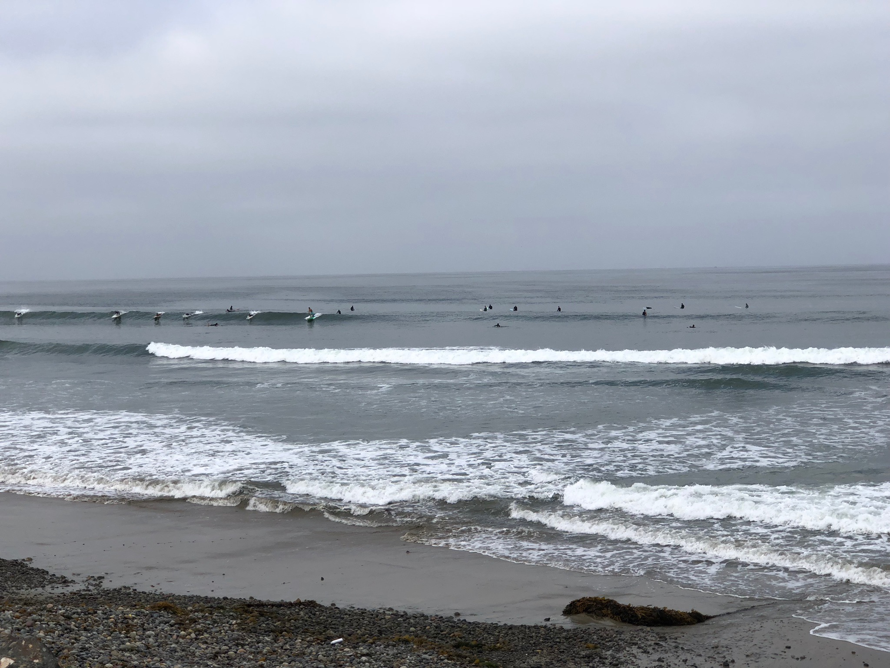

Contrary to today's tagline, I actively practice not rushing time. It goes fast enough on its own and I want to relish all of it as much as possible. That's part of the motivation for this journey. I could have chosen an adventure where I drove to lots of different spots and surfed them over the course of the summer but that didn't seem to be true enough to who I am, or at least who I consider myself to be, and it didn't seem like it would allow me to take everything in at my own pace. Nonetheless, I definitely find myself counting down the days. My right wrist, knee, and shoulder have all been aching for the past few days&mdash;the first two from biking and the last from surfing without much rest. I took it pretty easy in the water today and the nine mile nearly direct ride from home to work (today with a surf stop, of course) felt a lot shorter than those when I go way out of my way to find a spot in North County. Nine miles to work felt not far but at least a little annoying a few weeks ago. Now it's a sprint!

It was remarkably crowded in the water; I even heard someone get out around 7 and say, "it's been like this since 6," which is pretty rare. I guess the late weekend/early week swell got everyone motivated to catch a few more before it fizzles out completely, especially since summer is in full swing and we may not get many more great swells like this one for a few months now. Even with the crowd, it was a blast. For some reason I never mind the crowds at Tourmo nearly as much as I do elsewhere. I think the seemingly lazy but still powerful waves there give everyone enough of what they're looking for so there isn't as much agitation rippling through the lineup.

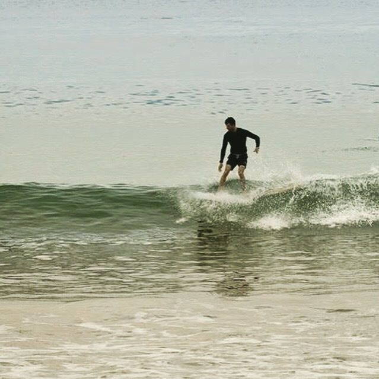
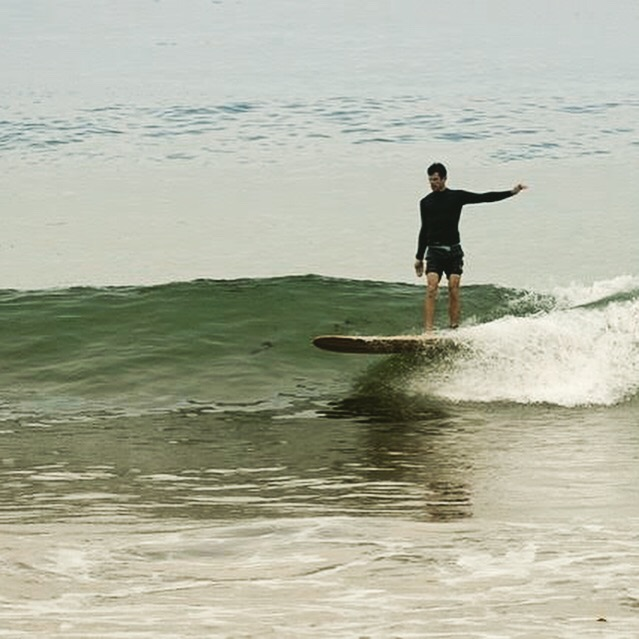
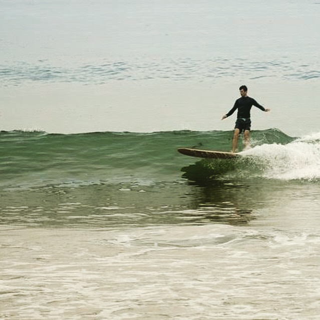
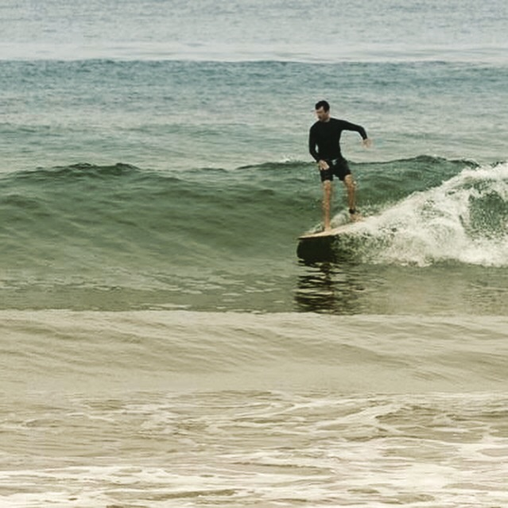

_A huge thanks to Carol Kent, whom I'd never met before today but who was taking pics on the beach and was kind enough to send me a few great shots!_

#### Day 11 (June 11, 2018): 15th St., Del Mar&mdash;righteous, righteous!
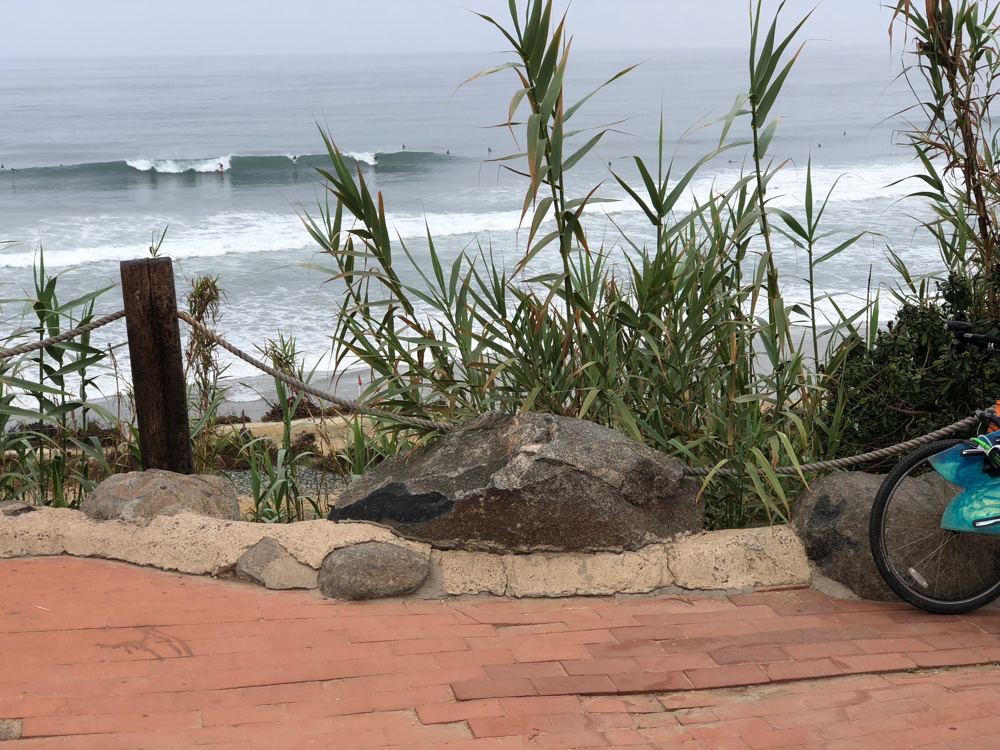

If the turtles from _Finding Nemo_ were real, they would've been surfing Del Mar today, yelling, "righteous! Righteous!" It wasn't scary big, but it was big. Definitely the biggest that I've both paddled out and caught a few waves in (without just falling on my face). I've paddled out in similar conditions but never caught much. Today felt different. I still cowardly backed out of a few after staring down the ledgy faces and letting the "flight" instinct win, but I also went for a few that just a year ago I probably wouldn't have considered.

A truly talented, poised surfer probably would’ve described this morning’s conditions as “pretty good” or maybe even “okay.” Since I don’t have to worry about being accused of either, I can say that it was possibly the best I’ve experienced. Light offshores, modest rips, and long period, double-overhead sets were the norm. What I normally would’ve called cleanup sets broke so far outside that they lost most of their energy before still pummeling me but not with nearly as much fierceness as I saw in them hundreds of yards away. I’ve definitely seen bigger waves and paddled out in tougher conditions but I’ve never been in the water when things lined up like this before.

Even better, I got to surf with a friend and colleague from [Sustainable Surf](http://sustainablesurf.org/) (one of the surfers probably calling today “pretty good”) and learn about their new Deep Blue Life program, focused on rallying surfers to first pay closer attention to and then work concertedly to reduce their carbon footprints. Turns out the number one contributor to (or the biggest slice of pie in the pie chart of) most surfers’ C footprints is their transportation to/from the waves. So, uh, #biketosurf, people! Even just from time to time; it’ll help.

#### Day 10 (June 10, 2018): Oceanside Pier&mdash;double digits!

Only three weeks till rest day ;) Today was really fun but very intimidating. I don't know North County well at all to begin with and had never surfed in Oceanside and it was very big. In my terms. Which means well overhead.  Fortunately it was a long period swell so there was a lot of time to catch my breath in between poundings when paddling out. I caught a few of the bigger waves I've ridden but a strong onshore wind was really chopping up the surface so I went flying off the face more than once. It also, it turns out, takes a while to get there by bike. I think this will be my northernmost session of the month. We'll see...

I also technically completed my first triathlon of the month. The Carlsbad Triathlon was taking place right on the main road I needed to take in order to get north to Oceanside and the cop stopped me when I got to the south end of the course to say I had to go roughly for miles inland to get around it or walk my bike and board for a bit over a mile (for reasons I don't totally understand, biking southward and walking both directions were allowed but biking northward on the course was not&mdash;maybe something to do with pacing the competitors..?). I opted for the latter but didn't want to walk&mdash;I wasn't trying to spend an extra twenty minutes on my way to the waves&mdash;so I jogged the mile or so with all of my gear. So got a nice bike, run, and surf in today.

#### Day 9 (June 9, 2018): Ponto&mdash;adventure is where you find it

(Check out the mileage shown in the bottom right of the watch face; I think I earned that beer!)

My first reaction to my first flat tire on the road was to be annoyed, of course, but it turned into a pretty cool experience. I carry spares of most things that I think I could need out there, including tubes and patches, but I was in the middle of Solana Beach when it happened and I thought it would be nice to use a floor pump, instead of my hand pump, to get a little more pressure into the repaired tube. So I pulled over at [Revolution Bike Shop](http://revolutionbikeshop.com/) and got to work. While I was getting things back in order, one of the mechanics came over to check out my board (a beautiful, eye-catching, wood veneered FireWire board) and exclaimed, "your fin has a chip in it!" Took me a sec to realize he meant not a bad scratch but rather a computer chip; he was checking out my Smartfin. He was really into it and started showing it off to the other mechanics which was pretty cool to see.

I surfed Ponto which looked immaculate when I showed up. Surf magazine cover immaculate. It stayed that way for maybe eight minutes after I got into the water during which time I barely caught one or two but it and I almost immediately ran out of juice. It went completely flat and I totally bonked (not sure that term's used much in surfing but it is in cycling (and other endurance sports) which is how I got there, so I think it's valid). For the next forty minutes, it was small and choppy. I decided to catch my last wave and it picked back up. I guess whatever storm generated the swell took a forty minute break but it came back in full force. This little excursion is definitely succeeding with regard to getting me out of my comfort zone...

#### Day 8 (June 8, 2018): Scripps Pier&mdash;World Oceans Day!

The choice for where to surf today was the most obvious one yet: where I truly learned how to surf and how to be an oceanographer. I'm incredibly lucky to call this my home break for many, many reasons, not least of which is the people I've met here throughout the years. Scripps has been known for producing and housing high quality scientists for over a century but it's our feeling of community that really makes it a great place to work and surf. I surfed next to one of the most preeminent atomspheric and oceanic scientists in the world as well as my buddy about whom I'll probably be saying the same in not all that long. Waves were great: chest &ndash; head high and really clean. Scripps is a great place to surf regularly but it's far from the best as waves frequently close out fast here. That was not the case today so I had a great time surfing and chatting with my friends and colleagues. Happy World Oceans Day, everyone! Please do something kind for the ocean today :) [(Here are some ideas for how.)](https://www.surfrider.org/coastal-blog/entry/world-oceans-day-is-june-8th-heres-how-you-can-make-a-difference)

#### Day 7 (June 7, 2018): Sunset Cliffs/Abs&mdash;epic is a story

People's reactions to the word "epic" are individual, based on personal experience. If you're an extreme athlete or YouTube-enabled-couch-junkie, the word likely conjures images of Shaun White hurtling through the air or Rodrigo Koxa screaming down the face of a Nazarean monster; bibliophiles may think of Odysseus and Frodo Baggins. For me, the word sounds like something hard to reach, especially without quitting (or at least changing) my job. I'm on a both month- and lifelong mission to make _epic_ attainable (not to mention sustainable).

Today's session was pretty mellow (I wouldn't necessarily say epic). But the bike ride along OB/Sunset Cliffs is positively gorgeous and, once again, I had a break almost to myself. Sets were pretty crossed-up but the good ones were really good&mdash;maybe shoulder high or so. The hardest part of today's trip was finding a way down to the water. I locked my bike up in the PLNU coastal lot and had to walk around for a while to find the path but the walk was well worth it! One of my primary motivators for doing this whole adventure was to discover new breaks that either I hadn't heard of or had heard of but didn't know how to get to or was too intimidated to try. I'd surfed Cliffs a handful of times before but never down here&mdash;but I'll definitely be back.

#### Day 6 (June 6, 2018): Bird Rock&mdash;incredibly, it just keeps getting better

It's hard to imagine a better start to any day in any place. I'm beginning to think that smaller waves might be at least as much fun as bigger ones because everyone I meet in the water on small days is simply stoked to be alive and in the water. Today I surfed Bird Rock with precisely one other person, one of the friendliest and easiest-to-talk-to guys I've ever met, named Rick. We shared the micro-A-frames for an hour; he went right and I left. Every time. When we simultaneously declared the session over, he paddled to some previously unknown (to me) rock wall and path to the right while I found my familiar staircase on the left. We talked about our families, our lives in Southern California, our roots on the East Coast (we both miss steamers and proper crabcakes), and how amazing it is to be able to take advantage of this beautiful resource that we have out our back doors, even when the swell is down.

From there, I pedaled straight up Bird Rock Ave to a meeting at Bird Rock Coffee Roasters (I'd call that a well planned morning) where I had an inspiring conversation about getting our science out into the world and making it more accessible to citizens of all trainings, backgrounds, and whereabouts, coastal and otherwise. Ben is a rad dude who seems particularly motivated to make a difference through multimedia promotion of other artists, craftspeople, and scientists who are trying to make a difference in their own ways.

Nice hanging out, Rick and Ben. I can only hope to have more days like today!

#### Day 5 (June 5, 2018): Tabletops&mdash;it's all about the bounce

I didn't make that phrase up&mdash;I don't really remember who did (maybe Susan Casey in _The Wave_)&mdash;but it refers to the maneuver, if you will, that surfers need to employ when surfing Teahupoo where getting thrown off of a wave could result in your pummeling on the reef. Today I surfed 2' Tabletops, which makes my comparison to one of the most iconic and critical waves in the world markedly ridiculous, but I kept hearing that phrase repeated in my head throughout the session. Tabletops gets its name, I surmise, from the slab of sandstone that juts roughly 75 yards into the ocean, keeping water depth constant across its width. Waves, even small waves, pitch up quickly when they arrive from comparatively deep (10 feet or more, depending on tide) water to the reef, resulting in a fast ride into very shallow water with an annoyingly hard bottom. I'm definitely going to have to check this spot out again some day when it's a little bigger to see what it's like when the wave (presumably) breaks much further away from shore but today it was about as intimidating as a 2 footer can be in my limited experience. I was startled every time I paddled back out after a wave and my arm reached only a foot or so into the water and touched the seagrass growing on the reef. The water wasn't particularly clear, for better or for worse, so I couldn't really tell where the shallow spots were until the wave took me close enough to see the boils on the surface. I'm never a very aggressive surfer but I took it extra easy today to avoid making too many direct observations of the benthos, though I did manage to scrape my fin on the reef on one duck dive.

Oh, and one other thing. The wind was awful! Not when I was in the water, but it was blasting out of the south (the direction I had to go to get to work after surfing) for the whole ride back. It actually made the relatively protected 500 foot climb up Torrey Pines the most pleasant part of the ride.

Okay, time to go vote (by bike&mdash;duh!).

#### Day 4 (June 4, 2018): Windansea&mdash;calm, quiet, and clean

Don't tell anyone, but this break is amazing... I don't think I've ever packed so much fun into such a short surf session. I had to patch my rear tire this morning right when I was about to head out the door and I thought I had an early meeting (it was cancelled while I was surfing... if only I knew!). So I tried to sprint (my legs were more than a little beat up from yesterday's long rides) up the coast from home to the break to squeeze a few waves in before heading to work. Conditions were right in my sweet spot: a dead calm surface, a terrible Surfline report (so almost no one else was out), and chest high sets. It was one of those mornings where you can hear the water lapping back and forth across your board because everything else is so still and silent. Sometimes that Surfline forecast just really works in your favor.

#### Day 3 (June 3, 2018): Tijuana Slough&mdash;crossed the 100 mile threshold!

Today was one of the coolest solo adventures I've done. I biked and surfed for about six hours total in nearly complete solitude. I saw only one other surfer the whole day and s/he was about two miles north of where I paddled out. Before today, I felt like I'd explored San Diego County reasonably well but after a few hours, I realized how much I've been missing. The San Diego Bayshore Bikeway (which nearly circles San Diego Bay) changes from completely urban to industrial to military to sprawling nature landscapes. I've done much of today's ride before but never alone with nothing but time to take it all in. And I'd seen the southern edge of the Tijuana River National Estuarine Research Reserve (AKA Border Field State Park) on a volunteer trip with Outdoor Outreach years ago but we went straight to the beach and didn't have a chance to explore the estuary. I don't know as much about the reserve as I'd like but it seems to me to be one of the most unaltered ecosystems on Southern California's coastline. On the other hand, it's infamous for its human-caused influx of pollution of many flavors (trash, sewage, etc.), especially during the rainy season when this surf break is effectively closed off for weeks at a time.

#### Day 2 (June 2, 2018): Boneyards&mdash;twice as much fun

Today was awesome! I cycled about 18 miles up the coast and met up with a wonderful friend who helped pick the spot. It was fairly small (waist high on average) but very clean and we even managed to find a spot with almost no one else. It seems like the last few times I've surfed with Mattias, it's been pretty small, but we always manage to have a blast. Mattias is just one of those people who are incredibly hard to be in anything less than a great mood when you're with them, no matter what the conditions.

#### Day 1 (June 1, 2018): Pipes&mdash;it begins!

This is going to be a challenge.

I knew it would be&mdash;that was kind of the point, or at least part of it&mdash;but, wow, my legs were completely exhausted by the time I got into work today after biking to the break, surfing, and biking to the office. It was _only_ a ~25 mile round trip but it was the first time I went more than a couple miles with my board and other gear on my bike.

But it was also a blast. Cycling and surfing are among my favorite activities so starting a Friday off with both was pretty incredible. It was a little on the crowded side, at least given the small take-off spot, but there seemed to be just the right number of waves in most sets for each of us to catch something.

#### Inspired by...
[Bike to Work Month](https://www.recreation.gov/marketing.do?goto=acm/Explore_And_More/exploreArticles/MayisNationalBikeMonth.htm), [Sustainable Surf](http://sustainablesurf.org/2015/09/bike-to-surf-week/), [My Wave Addiction](http://www.mywaveaddiction.com/bike-to-surf/index.html), many close friends & family members, and the ocean.
