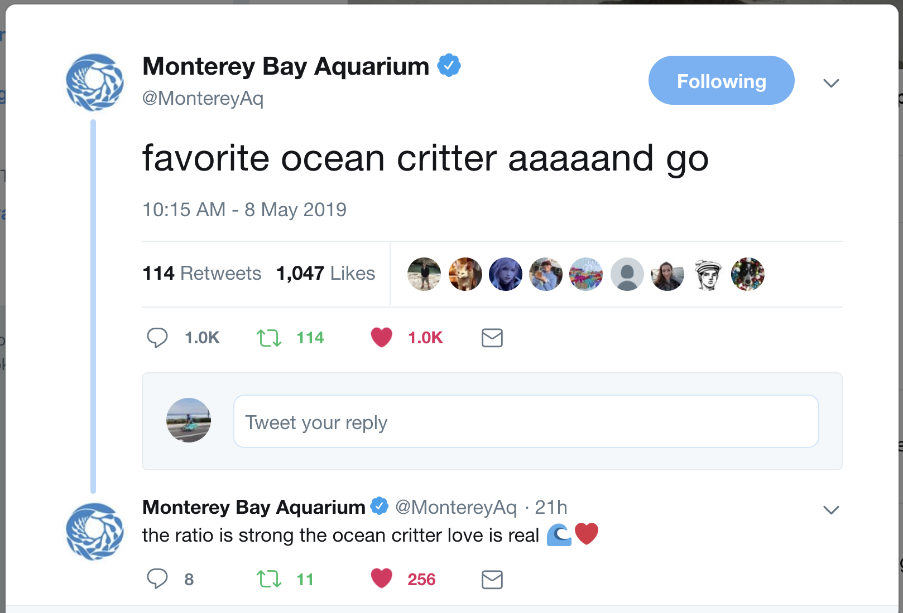

On exactly May 8, 2019, the venerable Monterey Bay Aquarium social media team asked its followers to name their favorite ocean critters.

This project could have stayed on Twitter but I was curious to see what the responses were, quantitatively, so I ran an analysis on the tweets.

That was interesting, but still left something to be desired: interactivity. This next figure shows the history of occurrence of certain favorite critters. That is, how many favorites did tweets from [@MontereyAq](https://twitter.com/MontereyAq) garner? Bubble size illustrates the number of favorites received from given tweet with mention of that critter. If you hover over the bubbles, a link to the tweet will pop up (though this feature is a little jumpy so you have to click a few times before it works).

    <iframe class="resp-iframe" src="../interactive-pages/montereyAq_twitter_critters.html"></iframe>

You can find all of the code that I used to scrape Twitter feeds and generate these figures in my GitHub repo here: https://github.com/SUPScientist/Twitter-Scraping.
