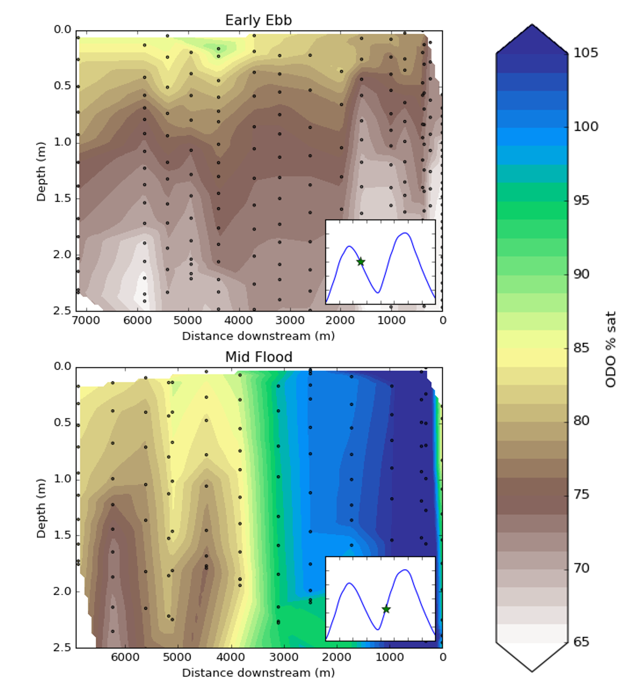

We are very curious to see what we can learn from finer scale biogeochemical studies than are typically conducted, especially in dynamic coastal and estuarine environments. Autonomous sensors are typically situated kilometers or further apart, but it is well known that significant variability can occur at meter or finer scales. Due to a lack of observations (often due to limitations in instrumentation), scientists often make simplifying assumptions, like declaring a shallow water body to be well mixed in the vertical dimension or a certain part of an ecosystem to be homogeneous in horizontal dimensions, even if that is not necessarily the case. These assumptions propagate into calculations of biologically and societally relevant rates, such as carbon sequestration and ecosystem metabolism.

Toward this pursuit, we are developing instrumentation for mobile platforms, including human-powered watercraft like paddleboards and surfboards (see also [Smartfin](../smartfin)), and methods such as shallow water quality profiling. We hope that these novel techniques can aid in the improvement and/or confirmation of rate estimates, in the prospecting of sites for stationary deployments, and in our understanding of spatial heterogeneity for improved prioritization of limited resources for management and conservation.

As one example of combined vertical and lateral variability, here is an illustration of dissolved oxygen (in percent saturation) in Alviso Slough, San Francisco, CA, USA. Black dots represent locations of measurements made with a YSI EXO2 multiparameter water quality instrument in a roughly 30-minute period. In the top panel, vertical gradients in dissolved oxygen are clear in just 2.5 m of water (even though no significant physical stratification was observed at this time!), likely as a result of benthic metabolism that wasn't mixed through tidal activity. In the bottom panel, vertical gradients still exist but are swamped by horizontal variability, likely as a result of different source waters coming from different upstream branches of the slough. In either case, a stationary moored instrument could miss a significant amount of variability.

