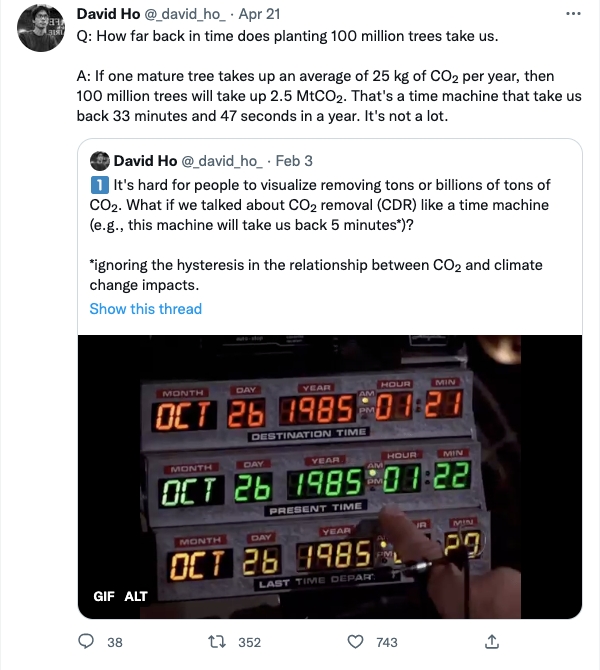

Motivated by the following tweets,  

we sought to make a simple HTML/JavaScript calculator that would allow people to test different values.  

Inputs: 
- **Carbon sequestered**: what is the potential sequestration of your approach?
- **Units in**: what are the units corresponding to your carbon sequestration potential? Options are tonnes C/year, tonnes CO2/year, and trees.  
- **Units out**: how far back in time is the carbon sequestration equivalent to (or how much time of a particular unit of human-caused carbon emissions is "undone" based on your sequestration)?  
- **Result**: how much time of human emissions is undone by your approach (in the units of **Units out**)?

Give it a shot:

    <iframe src="../interactive-pages/carbon_calculator.html" width="600"></iframe>

The calculator uses 2020's total anthropogenic emissions of 10.2±0.8 GtC/yr (37.4±2.9 GtCO2/yr) from the Global Carbon Budget: https://essd.copernicus.org/articles/14/1917/2022/essd-14-1917-2022.pdf. 

Important note: this webpage has no agenda beyond encouraging careful consideration of scale when discussing carbon and carbon offsets. We are pro-trees, pro-whales, etc., and hope that blue and green carbon ecosystems are preserved and restored, for many reasons!