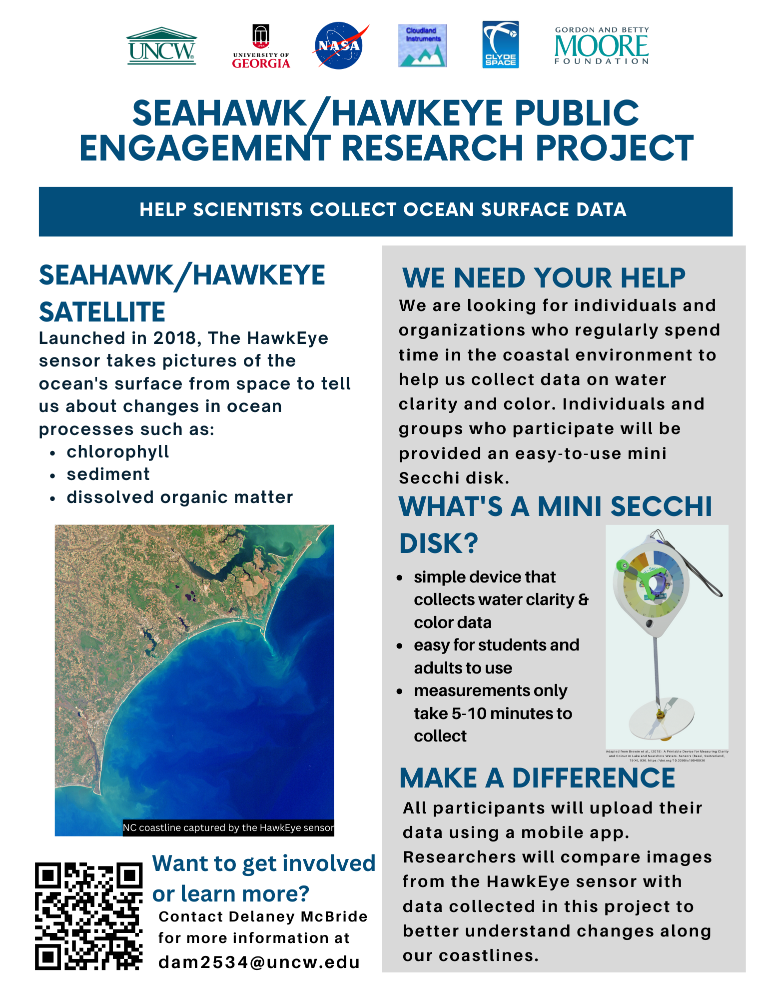

We are beginning a citizen/community science project as part of the SeaHawk/HawkEye ocean color remote sensing mission. For more information on the broader mission, please visit [SeaHawk/HawkEye Ocean Color Remote Sensing](../seahawk).

# How-To Resources
See below for several instructional resources covering the following topics:
- How to use the Mini-Secchi Disk
- How to access data on the MONOCLE website
- How to read the measuring tape for the most accurate possible readings
- How to attach extra weight to ensure a vertical downward cast even in stronger currents
- How to take care of your Mini-Secchi disk for optimal performance and longevity

## How to use the Mini-Secchi Disk
[Here are written instructions for using the mini-Secchi disk, followed by an instructional video below](../assets/pdf/Mini-Secchi How-To Guide.pdf "Mini-Secchi How-To Guide").

<iframe src="https://player.vimeo.com/video/827438726?h=1ab832388d&amp;badge=0&amp;autopause=0&amp;player_id=0&amp;app_id=58479" frameborder="0" allow="autoplay; fullscreen; picture-in-picture" allowfullscreen style="position:absolute;top:0;left:0;width:100%;height:100%;" title="Secchi disk how to guide"></iframe>

If you wish to log data and don't have access to the mobile app, please fill out this [Data Log](../assets/pdf/Mini-Secchi Data Log.pdf "Mini-Secchi Data Log.pdf").

## How to access data on the MONOCLE website
See the [MONOCLE Mini-Secchi disk activity dashboard](https://rsg.pml.ac.uk/dashboards/d/P0tWxs97k/monocle-secchi) to see all of the data collected in this and interrelated projects!

    <iframe class="resp-iframe" src="https://rsg.pml.ac.uk/dashboards/d/P0tWxs97k/monocle-secchi"></iframe>

Please watch the following video for more information on the MONOCLE website and data access:

<iframe src="https://player.vimeo.com/video/827438261?h=cac9356710&amp;badge=0&amp;autopause=0&amp;player_id=0&amp;app_id=58479" frameborder="0" allow="autoplay; fullscreen; picture-in-picture" allowfullscreen style="position:absolute;top:0;left:0;width:100%;height:100%;" title="Monocle data access_updated"></iframe>

## Measuring Tape How-To
How to read the measuring tape for the most accurate possible readings:

<iframe src="https://player.vimeo.com/video/908330061?badge=0&amp;autopause=0&amp;player_id=0&amp;app_id=58479" frameborder="0" allow="autoplay; fullscreen; picture-in-picture" style="position:absolute;top:0;left:0;width:100%;height:100%;" title="Measuring Tape How-To"></iframe>

## Weight Attachment How-To
How to attach extra weight to ensure a vertical downward cast even in stronger currents

<iframe src="https://player.vimeo.com/video/908332326?badge=0&amp;autopause=0&amp;player_id=0&amp;app_id=58479" frameborder="0" allow="autoplay; fullscreen; picture-in-picture" style="position:absolute;top:0;left:0;width:100%;height:100%;" title="Secchi Weight Attachment"></iframe>

## Secchi Disk Maintenance
How to take care of your Mini-Secchi disk for optimal performance and longevity

<iframe src="https://player.vimeo.com/video/908332303?badge=0&amp;autopause=0&amp;player_id=0&amp;app_id=58479" frameborder="0" allow="autoplay; fullscreen; picture-in-picture" style="position:absolute;top:0;left:0;width:100%;height:100%;" title="Secchi Disk Maintenance"></iframe>
