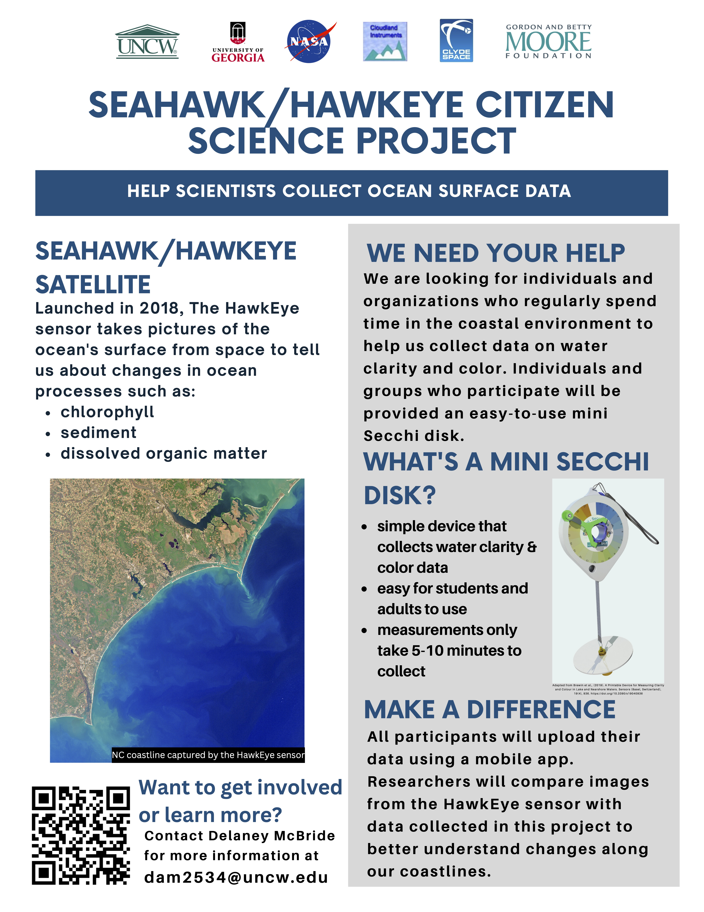

We are beginning a citizen/community science project as part of the SeaHawk/HawkEye ocean color remote sensing mission. For more information on the broader mission, please visit [SeaHawk/HawkEye Ocean Color Remote Sensing](../seahawk).

# How-To Videos
## How to use the Mini-Secchi Disk

<iframe src="https://player.vimeo.com/video/827438726?h=1ab832388d&amp;badge=0&amp;autopause=0&amp;player_id=0&amp;app_id=58479" frameborder="0" allow="autoplay; fullscreen; picture-in-picture" allowfullscreen style="position:absolute;top:0;left:0;width:100%;height:100%;" title="Secchi disk how to guide"></iframe>

## How to access data on the MONOCLE website

<iframe src="https://player.vimeo.com/video/827438261?h=cac9356710&amp;badge=0&amp;autopause=0&amp;player_id=0&amp;app_id=58479" frameborder="0" allow="autoplay; fullscreen; picture-in-picture" allowfullscreen style="position:absolute;top:0;left:0;width:100%;height:100%;" title="Monocle data access_updated"></iframe>

